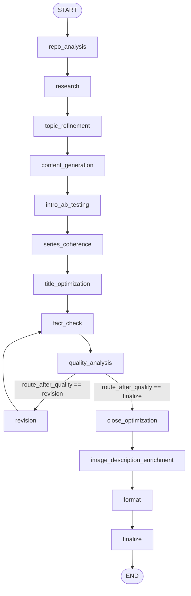
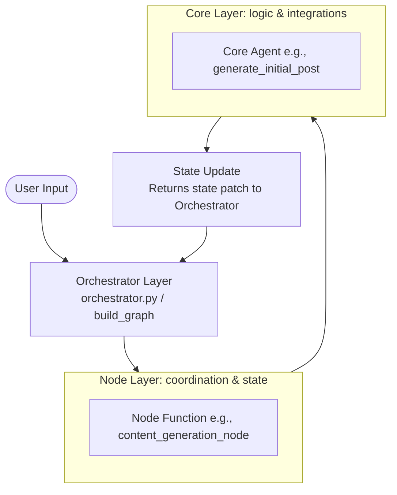

# ARCHITECTURE

## Pipeline Topology

14 nodes, linear with one conditional loop. `build_graph()` in `backend/app/agents/orchestrator.py`.

**Ordered node list (exact names as registered in `build_graph()`):**

| Order | Node name | Node function |
|-------|-----------|---------------|
| 1 | `repo_analysis` | `repo_analysis_node` |
| 2 | `research` | `research_node` |
| 3 | `topic_refinement` | `topic_refinement_node` |
| 4 | `content_generation` | `content_generation_node` |
| 5 | `intro_ab_testing` | `intro_ab_testing_node` |
| 6 | `series_coherence` | `series_coherence_node` |
| 7 | `title_optimization` | `title_optimization_node` |
| 8 | `fact_check` | `fact_check_node` |
| 9 | `quality_analysis` | `quality_analysis_node` |
| 10a | `revision` (loop) | `content_revision_node` |
| 10b | `close_optimization` (pass) | `close_optimization_node` |
| 11 | `image_description_enrichment` | `image_description_enrichment_node` |
| 12 | `format` | `format_node` |
| 13 | `finalize` | `finalize_node` |

**Static edges (exact from `build_graph()`):**

```
START → repo_analysis
repo_analysis → research
research → topic_refinement
topic_refinement → content_generation
content_generation → intro_ab_testing
intro_ab_testing → series_coherence
series_coherence → title_optimization
title_optimization → fact_check
fact_check → quality_analysis
[conditional] quality_analysis --"finalize"--> close_optimization
[conditional] quality_analysis --"revision"---> revision
revision → fact_check          (loop-back)
close_optimization → image_description_enrichment
image_description_enrichment → format
format → finalize
finalize → END
```

**Mermaid flowchart:**




---

## Modular Graph Node Architecture

To maintain code readability, loose coupling, and strict file size limits (keeping individual files under 300 lines), the 14 LangGraph nodes that orchestrate the pipeline have been extracted from `orchestrator.py` and modularized into separate files under `backend/app/agents/nodes/`.

This separation of concerns establishes a clear three-tiered control flow:
1. **User Input / Orchestrator**: The outer entry points (`run_pipeline()`, `run_series()`, `build_graph()`) initialize the state, define the edges, and compile the compiled graph.
2. **Node Layer**: Functions located in `backend/app/agents/nodes/` manage coordination, transition logic, error handling, database updates, and state modification.
3. **Core Layer**: Underlying agent modules (e.g., `web_researcher.py`, `content_generator.py`, `quality_analyzer.py`) perform the heavy lifting of LLM calls, prompt construction, and external API requests.

### Control Flow Diagram



### The Mock/Patch Testing Pattern & Local Imports

A key design constraint of this modular architecture is that **node functions must perform imports of settings, logger, and core tools locally inside the function scope**, rather than globally at the module level. 

#### Why Local Imports are Required:

1. **Circularity Avoidance**: 
   Because `orchestrator.py` imports all the node functions (e.g., `from app.agents.nodes.repo_analysis import repo_analysis_node`) to build and compile the graph, any global import back to `orchestrator.py` from within those node files would create an immediate circular dependency at module loading time, causing startup crashes.

2. **Python Module Caching & Test Mocking/Patching**:
   Python caches imported modules in `sys.modules`. When a module is loaded, any top-level imports resolve immediately and bind the imported names to the module's global namespace. 
   
   If a node module were to import `settings` or `logger` globally:
   ```python
   # DO NOT DO THIS globally in node files:
   from app.core.config import settings
   from app.agents.orchestrator import log_step
   ```
   Then, during unit testing:
   - When a test tries to patch these dependencies (e.g., `mock.patch("app.core.config.settings")` or `mock.patch("app.agents.orchestrator.log_step")`), the patch replaces the attribute inside the target source module.
   - However, because the node module already resolved and bound its top-level reference at initial load time (before the test applied the mock), the node function continues using the *cached, original reference* instead of the mocked one.
   
   By moving imports inside the node function:
   ```python
   async def content_generation_node(state: Dict[str, Any]) -> Dict[str, Any]:
       # Correct: Local imports defer binding until function execution
       from app.agents.orchestrator import generate_initial_post, log_step, settings
       ...
   ```
   - Python executes the import statement **dynamically at execution time** when the node runs.
   - It fetches the active reference from `sys.modules` at that moment.
   - If a test has applied a patch or mock to `settings` or `log_step`, the node function successfully retrieves the mocked/patched instance, ensuring test isolation and control over side effects.

---

## PipelineState Schema

`PipelineState(TypedDict)` defined at `orchestrator.py:85`.

| Field | Type | Populated by | Consumed by | Notes |
|-------|------|--------------|-------------|-------|
| `run_id` | `str` | `run_pipeline()` init | all nodes | UUID; persisted to MongoDB `pipeline_runs` |
| `custom_topic` | `str` | `run_pipeline()` init | `research_node`, `content_generation_node`, `topic_refinement_node` | raw user input |
| `grounding_context` | `str` | `run_pipeline()` init | `topic_refinement_node`, `content_generation_node` | optional user-supplied facts |
| `series_id` | `str \| None` | `run_pipeline()` init | `content_generation_node`, `finalize_node` | set by `run_series()` |
| `series_position` | `int \| None` | `run_pipeline()` init | `series_coherence_node`, `finalize_node` | 1-based position in series |
| `series_context` | `str` | `run_pipeline()` init | `content_generation_node`, `series_coherence_node` | angle + hook seed from series planner; `""` for standalone |
| `trend_context` | `str` | `research_node` | `topic_refinement_node`, `content_generation_node` | Tavily aggregated output; `""` when Tavily unavailable |
| `refined_topic` | `str \| None` | `topic_refinement_node` | `content_generation_node` | `TopicBrief.formatted_brief`; fallback to `custom_topic` on error |
| `topic_brief` | `dict \| None` | `topic_refinement_node` | `content_generation_node`, `title_optimization_node`, `intro_ab_testing_node`, `series_coherence_node`, `close_optimization_node`, `image_description_enrichment_node`, `finalize_node` | `TopicBrief.model_dump()` for MongoDB storage |
| `post` | `GeneratedPost \| None` | `content_generation_node` | `title_optimization_node`, `intro_ab_testing_node`, `series_coherence_node`, `fact_check_node`, `quality_analysis_node`, `content_revision_node`, `close_optimization_node`, `image_description_enrichment_node`, `format_node`, `finalize_node` | central content artifact |
| `quality_report` | `QualityReport \| None` | `quality_analysis_node` | `content_revision_node`, `route_after_quality`, `finalize_node`, `_compute_publication_recommendation` | G-Eval + structural scores |
| `pull_quote` | `str \| None` | `format_node` | `finalize_node`, API response | best quotable sentence extracted verbatim |
| `format_changes` | `Annotated[list[str], operator.add]` | `format_node` | `finalize_node`, API response | **reducer**: list appended across invocations |
| `revision_count` | `int` | `content_generation_node` (set 0), `content_revision_node` (incremented) | `quality_analysis_node`, `route_after_quality`, `content_revision_node`, `finalize_node` | max bounded by `settings.max_revision_cycles` (default 6) |
| `quality_history` | `Annotated[list[dict], operator.add]` | `quality_analysis_node` | `content_revision_node`, `finalize_node` | **reducer**: one entry appended per quality analysis cycle |
| `fact_check_issues` | `list[QualityIssue]` | `fact_check_node` | `quality_analysis_node` | unverifiable claims; merged into quality report issues |
| `fact_check_results` | `list[VerificationResult]` | `fact_check_node` | `format_node`, `finalize_node`, `_compute_publication_recommendation` | all verification results; re-injected in format to survive revision rewrites |
| `errors` | `Annotated[list[str], operator.add]` | any failing node | `route_after_quality`, `finalize_node`, `_compute_publication_recommendation` | **reducer**: accumulated across nodes |
| `completed_steps` | `Annotated[list[str], operator.add]` | every node | API response | **reducer**: audit log of executed steps |
| `recommended_publication` | `bool` | `finalize_node` | API response | computed by `_compute_publication_recommendation` |
| `publication_confidence` | `float` | `finalize_node` | API response | 0.0–1.0; capped at 0.70 when max revisions exhausted |
| `draft_content` | `str` | `close_optimization_node` | `format_node` | post content after close replacement; `""` until close_optimization runs |
| `title_variants` | `list[str]` | `title_optimization_node` | API response | candidate titles; empty list if optimization skips |
| `intro_variants` | `list[str]` | `intro_ab_testing_node` | API response | candidate openings; empty list if A/B test skips |
| `series_coherence_score` | `float \| None` | `series_coherence_node` | API response | `None` for standalone posts |
| `image_enrichment_changes` | `list[str]` | `image_description_enrichment_node` | API response | descriptions of each enriched placeholder |
| `repo_path` | `str \| None` | `run_pipeline()` init | `repo_analysis_node` | local path; `None` = skip repo analysis |
| `evidence_brief` | `dict \| None` | `repo_analysis_node` | `topic_refinement_node` | `EvidenceBrief.model_dump()`; `None` when `repo_path` is absent |

**Annotated reducer fields** (use `operator.add` — LangGraph appends, never overwrites):
`format_changes`, `quality_history`, `errors`, `completed_steps`

---

## Routing Logic

`route_after_quality(state)` — conditional edge on `quality_analysis` node.

| Condition (evaluated in order) | Return value | Resolves to node |
|--------------------------------|--------------|-----------------|
| `state.get("errors")` is non-empty | `"finalize"` | `close_optimization` |
| `state.get("quality_report")` is `None` | `"finalize"` | `close_optimization` |
| `_gate_check(report)` returns `passed=True` | `"finalize"` | `close_optimization` |
| `state["revision_count"] >= settings.max_revision_cycles` | `"finalize"` | `close_optimization` |
| all above false | `"revision"` | `revision` |

`_gate_check(report)` — four independent gates, all must pass:

| Gate | Condition | Failure message pattern |
|------|-----------|------------------------|
| 1 — Overall score | `report.score < settings.min_quality_score` (default 0.70) | `"score X.XX below minimum 0.70"` |
| 2 — Read ratio | `report.read_ratio_prediction < settings.min_read_ratio` (default 0.65) | `"read ratio XX% below minimum 65%"` |
| 3 — AI patterns | any issue with `severity="high"` and `category.startswith("ai_")`, when `settings.block_high_ai_patterns=True` | `"N high-severity AI pattern(s): ..."` |
| 4 — Word count | `report.word_count < settings.min_word_count` (default 1300) | `"word count N below minimum 1300 — add ~N words"` |

**Revision model escalation** (inside `content_revision_node`):

| `revision_count` after increment | Model used |
|-----------------------------------|-----------|
| 1 | `worker` (Haiku) |
| 2 | `worker` (Haiku) |
| 3+ | `worker` (Haiku) — note: `get_model_name("worker")` always used; no sonnet escalation in current code |

Special case: when only Gate 4 (word count) fails, `expand_post` is called instead of `revise_post` (additive section append, not full rewrite).

---

## Model Routing

`get_llm(role)` / `get_model_name(role)` in `backend/app/agents/llm_factory.py`.

Priority order (first true wins):

| Priority | Condition | Backend | `worker` model | `supervisor` model |
|----------|-----------|---------|---------------|-------------------|
| 1 | `USE_LOCAL_LLM=true` | `ChatOllama` | `LOCAL_LLM_MODEL` (default: `llama3.2`) | same |
| 2 | `USE_DEEPSEEK=true` | `ChatOpenAI` (DeepSeek-compat) | `DEEPSEEK_MODEL` (default: `deepseek-chat`) | same |
| 3 (default) | — | `ChatAnthropic` | `WORKER_MODEL` (default: `claude-haiku-4-5-20251001`) | `SUPERVISOR_MODEL` (default: `claude-sonnet-4-6`) |

**Per-agent role assignment:**

| Agent module | Role passed to `get_llm` | Default model |
|--------------|--------------------------|--------------|
| `content_generator.py` | `"worker"` | Haiku |
| `quality_analyzer.py` | `"worker"` | Haiku |
| `formatter.py` | `"worker"` | Haiku |
| `topic_refiner.py` | `"supervisor"` | Sonnet |
| `title_optimizer.py` | `"worker"` | Haiku |
| `intro_ab_tester.py` | `"worker"` | Haiku |
| `series_coherence_checker.py` | `"worker"` | Haiku |
| `close_optimizer.py` | `"worker"` | Haiku |
| `image_description_enricher.py` | `"worker"` | Haiku |
| `fact_checker.py` (claim extraction) | `"worker"` | Haiku |
| `web_researcher.py` | `"worker"` | Haiku |
| `series_planner.py` | `"worker"` | Haiku |
| `publication_matcher.py` | `"worker"` | Haiku |
| `read_ratio_analyzer.py` (hook score) | `"worker"` | Haiku |
| `prompt_analyst.py` | `"worker"` | Haiku |

Token pricing (from `base.py`): Haiku `$0.25/$1.25` per 1M in/out; Sonnet `$3.00/$15.00`; DeepSeek V3 `$0.27/$1.10`.

---

## Data Contracts

### EvidenceBrief (`backend/app/models/evidence_brief.py`)

Returned by `RepoAnalyzer.analyze()`, stored as `evidence_brief` (dict) in `PipelineState`.

| Field | Type | Constraint | Purpose |
|-------|------|-----------|---------|
| `repository_path` | `str` | `min_length=1`, no whitespace-only | Normalized absolute path |
| `stack` | `list[str]` | `min_length=1`, no blank items | Detected languages/frameworks/tools |
| `commands` | `dict[str, str]` | no blank keys or values; default `{}` | Run commands extracted from Makefile/package.json/pyproject |
| `architecture_hints` | `list[str]` | no blank items; default `[]` | Patterns: monorepo, microservices, etc. |
| `metrics` | `dict[str, int]` | non-negative integers only; default `{}` | `files_scanned`, test counts, etc. |
| `evidence` | `list[str]` | `min_length=1`, no blank items | Key facts for editorial grounding |

### GeneratedPost (`backend/app/agents/content_generator.py`)

Central content artifact carried through `PipelineState["post"]`.

| Field | Type | Notes |
|-------|------|-------|
| `title` | `str` | Replaced by `title_optimization_node` |
| `subtitle` | `str` | Optional teaser line |
| `content` | `str` | Markdown body; mutated by multiple nodes in-place |
| `tags` | `list[str]` | str→list field_validator with unicode-normalizer fallback |
| `image_suggestions` | `list[str]` | Updated by `image_description_enrichment_node` |

Content flow: `content_generation_node` creates → `intro_ab_testing_node` replaces first paragraph → `series_coherence_node` optionally rewrites body → `fact_check_node` injects hyperlinks → `close_optimization_node` replaces last paragraph → `image_description_enrichment_node` enriches `[IMAGE: ...]` blocks → `format_node` splits long paragraphs + adds separator → `finalize_node` runs `inject_captions` + `merge_sources_sections`.
