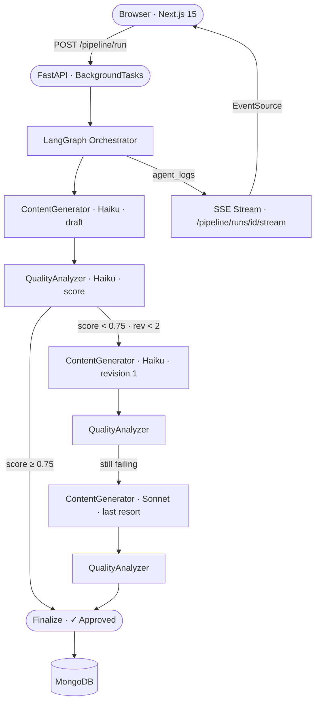

# medium-agent-factory

[](https://github.com/GatoProgramador-01/medium-agent-factory/actions/workflows/ci.yml)
[](https://github.com/GatoProgramador-01/medium-agent-factory/actions/workflows/eval.yml)
[](https://www.python.org/)
[](https://nodejs.org/)
[](LICENSE)

A production-grade LLM content pipeline built on **LangGraph** + **FastAPI** + **Next.js**. Give it a topic — it writes, scores, and revises a full article using a multi-agent loop, then streams every step live to the browser.

> **The meta story:** the three posts in `/posts` were written by this pipeline about this pipeline. All three scored 0.82 on the first attempt with zero revisions.

---

## Features

- **Multi-agent revision loop** — ContentGenerator writes, QualityAnalyzer scores (0–1), the graph routes back for revision if the score is below threshold
- **Cheapest-first model strategy** — Claude Haiku for all attempts, Sonnet only as last resort (10× cheaper in the best case)
- **Live SSE streaming** — browser receives agent logs in real time via `EventSource`, no polling
- **3-layer eval pipeline** — CI blocks bad prompt changes before they merge
- **One-env-var Ollama switch** — `USE_LOCAL_LLM=true` routes the entire pipeline to a local model, zero code changes
- **Prompt versioning** — all prompts are `.txt` files in `backend/prompts/`, versioned in git, eval gate triggers on every change
- **LangChain retry + tenacity** — transient API errors retry automatically with exponential backoff

---

## Architecture



### Cost model

| Path | Models used | Approx cost |
|---|---|---|
| Passes first attempt | Haiku × 2 | ~$0.005 |
| One Haiku revision | Haiku × 4 | ~$0.012 |
| Sonnet last resort | Haiku × 4 + Sonnet × 2 | ~$0.035 |
| Always-Sonnet (baseline) | Sonnet × 2 | ~$0.050 |

Worst case is still 30% cheaper than always using Sonnet.

---

## LLMOps patterns

| Week | Pattern | What it solves |
|---|---|---|
| 1 | **3-layer eval pipeline** | Catches quality regressions in CI before they reach production |
| 2 | **Ollama local switch** | Zero-cost local testing; one env var flips the entire pipeline |
| 2 | **SSE streaming** | Browser receives live logs without polling (no `setInterval`) |
| 3 | **Prompt versioning** | Prompts are git-tracked; any `.txt` change triggers the eval gate |
| 4 | **LangChain retry** | Anthropic rate limits and transient errors are handled automatically |

---

## Stack

| Layer | Technology |
|---|---|
| Orchestration | LangGraph (StateGraph) |
| LLM | Claude Haiku 4.5 (worker) · Claude Sonnet 4.6 (supervisor) |
| Agent framework | LangChain · structured output via Pydantic |
| Backend | FastAPI · Motor (async MongoDB) |
| Observability | LangSmith tracing · per-agent token + cost tracking |
| Frontend | Next.js 15 · React 19 · TypeScript · Tailwind CSS · Recharts |
| Local LLM | Ollama (opt-in via `USE_LOCAL_LLM=true`) |
| CI/CD | GitHub Actions (3 workflows) · Railway · Vercel |
| Database | MongoDB 7 (local Docker) · MongoDB Atlas (production) |

---

## Quick start

### Prerequisites

- Python 3.11+
- Node.js 22+
- Docker (for local MongoDB) or a MongoDB instance on port 27017
- [Anthropic API key](https://console.anthropic.com)

### 1. Clone and configure

```bash
git clone https://github.com/GatoProgramador-01/medium-agent-factory
cd medium-agent-factory
cp .env.example .env
# Open .env and add ANTHROPIC_API_KEY — everything else has defaults
```

### 2. Start MongoDB

```bash
docker run -d -p 27017:27017 --name mongo mongo:7
```

Or use the full Docker Compose stack instead (see below).

### 3. Backend

```bash
cd backend
python -m venv .venv

# Windows
.venv\Scripts\activate
# macOS / Linux
source .venv/bin/activate

pip install -e ".[dev]"
uvicorn app.main:app --reload
# API running at http://localhost:8000
# Interactive docs at http://localhost:8000/docs
```

### 4. Frontend

```bash
cd frontend
npm install
npm run dev
# App running at http://localhost:3000
```

### 5. Run the pipeline

Open `http://localhost:3000/pipeline`, type a topic, press Enter or click **run_pipeline**.

Or via curl:

```bash
curl -X POST http://localhost:8000/pipeline/run \
  -H "Content-Type: application/json" \
  -d '{"custom_topic": "how I cut my LLM costs by 10x with Ollama"}'
```

---

## Docker Compose

```bash
# Full stack — backend + frontend + MongoDB
docker compose up

# With local Ollama (free, no Anthropic API calls)
docker compose --profile local-llm up
docker compose exec ollama ollama pull llama3.2
# Then set USE_LOCAL_LLM=true in .env and restart backend
```

---

## Development

### Backend checks

```bash
cd backend

# Format
black .

# Lint
ruff check .

# Type check (strict)
mypy app/

# Unit tests
pytest tests/ -v

# Eval gate (Layer 1 + 2 — runs in CI on every PR)
pytest evals/ -v -m "not eval_deep"

# Nightly deep evals (LLM-as-judge)
pytest evals/ -v -m eval_deep

# Visual experiment in LangSmith
python -m evals.langsmith_eval "my-experiment-name"
```

### Frontend checks

```bash
cd frontend

npx tsc --noEmit   # type check
npm run lint       # ESLint
npm run build      # production build (catches runtime errors tsc misses)
```

---

## Eval pipeline

The project ships with a 3-layer quality gate that runs in CI on every PR touching agent code or prompts.

| Layer | What it checks | Cost | When |
|---|---|---|---|
| Score direction | Good posts ≥ 0.70, bad posts ≤ 0.55 | ~$0.002/case | Every PR |
| Cohort mean | Mean scores don't drift from baseline | ~$0.04 total | Every PR |
| LLM-as-judge | Revision prompts are specific and actionable | ~$0.005/case | Nightly only |

CI path filter — only runs when these paths change:

```
backend/app/agents/**
backend/prompts/**
backend/evals/**
backend/pyproject.toml
```

---

## CI/CD

Three GitHub Actions workflows:

### `ci.yml` — runs on every push and PR to master

| Job | Steps |
|---|---|
| Backend CI | `ruff check` · `black --check` · `mypy app/` |
| Frontend CI | `tsc --noEmit` · `next lint` · `next build` |
| Docker build | Builds both images (PRs only, no push) |

### `eval.yml` — runs on PRs that touch agent code or prompts

Executes Layer 1 + 2 evals (`-m "not eval_deep"`). Blocks merge if score direction accuracy drops below 75%.

### `deploy.yml` — runs on push to master

```
build       → push backend:sha + frontend:sha to GHCR
deploy-backend  → railway up --service backend
deploy-frontend → vercel build + vercel deploy --prebuilt --prod
summary     → GitHub Step Summary table
```

Concurrency guard prevents two deploys running in parallel (`cancel-in-progress: false` — second deploy queues, never cancels the first).

---

## Deployment

Production stack: **Railway** (backend) + **Vercel** (frontend) + **MongoDB Atlas** (free M0).

### Required GitHub secrets

| Secret | Where to get it |
|---|---|
| `ANTHROPIC_API_KEY` | console.anthropic.com |
| `LANGCHAIN_API_KEY` | smith.langchain.com |
| `RAILWAY_TOKEN` | railway.app → Account Settings → Tokens |
| `VERCEL_TOKEN` | vercel.com → Account Settings → Tokens |

### Required GitHub variables

| Variable | Value |
|---|---|
| `NEXT_PUBLIC_API_URL` | Your Railway service URL |
| `BACKEND_URL` | Your Railway service URL |
| `FRONTEND_URL` | Your Vercel project URL |
| `VERCEL_ORG_ID` | Vercel Account Settings → General |
| `VERCEL_PROJECT_ID` | Vercel Project Settings → General |

Once secrets and variables are set, every push to `master` deploys automatically.

---

## Project structure

```
medium-agent-factory/
├── backend/
│   ├── app/
│   │   ├── agents/
│   │   │   ├── orchestrator.py      ← LangGraph StateGraph pipeline
│   │   │   ├── content_generator.py ← Claude Haiku/Sonnet writer
│   │   │   ├── quality_analyzer.py  ← Claude Haiku scorer
│   │   │   ├── llm_factory.py       ← get_llm(role) — Anthropic or Ollama
│   │   │   ├── retry.py             ← LangChain + tenacity retry wrappers
│   │   │   └── base.py              ← AgentTokenTracker (cost + latency to MongoDB)
│   │   ├── api/
│   │   │   ├── pipeline.py          ← trigger endpoint + SSE stream
│   │   │   ├── posts.py
│   │   │   └── analytics.py
│   │   ├── prompt_loader.py         ← loads prompts/ at startup, caches in dict
│   │   ├── config.py                ← all settings via pydantic-settings
│   │   └── main.py
│   ├── prompts/                     ← all LLM prompts as .txt files (git-versioned)
│   │   ├── quality_analyzer_system.txt
│   │   ├── quality_analyzer_human.txt
│   │   ├── content_generator_system.txt
│   │   ├── content_generator_human_initial.txt
│   │   └── content_generator_human_revision.txt
│   ├── evals/
│   │   ├── datasets/
│   │   │   └── quality_analyzer.jsonl  ← curated test cases (good + bad posts)
│   │   ├── conftest.py              ← dataset fixtures + MongoDB mock (autouse)
│   │   ├── test_quality_analyzer.py ← Layer 1 + 2 + 3 eval tests
│   │   └── langsmith_eval.py        ← visual experiment runner for LangSmith UI
│   ├── tests/                       ← unit tests (mocked LLM)
│   ├── Dockerfile
│   └── pyproject.toml
├── frontend/
│   └── src/app/
│       ├── pipeline/page.tsx        ← SSE EventSource live log terminal
│       ├── posts/page.tsx           ← post list with quality score bars
│       └── analytics/page.tsx       ← per-agent token + cost charts
├── docs/
│   └── langgraph_explained.md       ← full architecture walkthrough
├── .github/workflows/
│   ├── ci.yml                       ← lint · typecheck · build · docker
│   ├── eval.yml                     ← eval gate (path-filtered, PR only)
│   └── deploy.yml                   ← build → Railway + Vercel (master push)
├── docker-compose.yml               ← backend + frontend + MongoDB + Ollama (profile)
└── .env.example
```

---

## Configuration reference

| Variable | Default | Description |
|---|---|---|
| `ANTHROPIC_API_KEY` | **required** | Anthropic API key |
| `MONGODB_URI` | `mongodb://localhost:27017` | MongoDB connection string |
| `MONGODB_DATABASE` | `medium_agent_factory` | Database name |
| `SUPERVISOR_MODEL` | `claude-sonnet-4-6` | Model used on the final revision attempt |
| `WORKER_MODEL` | `claude-haiku-4-5-20251001` | Model used for initial generation and first revision |
| `MIN_QUALITY_SCORE` | `0.75` | Minimum score to approve a post without revision |
| `MAX_REVISION_CYCLES` | `2` | Max revision attempts before forced approval |
| `USE_LOCAL_LLM` | `false` | Route entire pipeline to Ollama |
| `LOCAL_LLM_MODEL` | `llama3.2` | Ollama model name |
| `LOCAL_LLM_BASE_URL` | `http://ollama:11434` | Ollama endpoint (use `localhost:11434` outside Docker) |
| `LANGCHAIN_TRACING_V2` | `false` | Enable LangSmith tracing |
| `LANGCHAIN_API_KEY` | — | LangSmith API key |
| `LANGCHAIN_PROJECT` | `medium-agent-factory` | LangSmith project name |

---

## API reference

| Method | Endpoint | Description |
|---|---|---|
| `POST` | `/pipeline/run` | Trigger async pipeline run, returns `run_id` immediately |
| `POST` | `/pipeline/run/sync` | Trigger blocking pipeline run, waits for completion |
| `GET` | `/pipeline/runs` | List all pipeline runs |
| `GET` | `/pipeline/runs/{id}` | Get run status and metadata |
| `GET` | `/pipeline/runs/{id}/logs` | Get all log entries for a run |
| `GET` | `/pipeline/runs/{id}/stream` | SSE live log stream (closes with `__done__` event) |
| `GET` | `/posts` | List all posts, optional `?status=` filter |
| `GET` | `/posts/{run_id}` | Get post with full quality report |
| `GET` | `/analytics/token-usage` | Per-agent token and cost breakdown |
| `GET` | `/analytics/summary` | Aggregate pipeline stats |

Full interactive docs: `http://localhost:8000/docs`

---

## The posts this pipeline wrote about itself

After all four LLMOps weeks were complete, the pipeline was given topics about what it had just built:

| Title | Score | Revisions |
|---|---|---|
| How I Built a Self-Evaluating LLM Pipeline That Blocks Bad AI Writing | 0.82 | 0 |
| LLMOps Skills That Will Actually Get You Hired in 2025 | 0.82 | 0 |
| One Environment Variable Killed My LLM API Bills | 0.82 | 0 |

All three passed on the first attempt. The QualityAnalyzer's consistent feedback across all three: section headers were slightly too formulaic. The pipeline correctly diagnosed its own writing patterns.

---

## Roadmap

- [ ] Production deploy (Railway + Vercel + MongoDB Atlas)
- [ ] Redis response cache — skip API call for identical prompts
- [ ] Prompt A/B testing — run two versions against the eval set, keep the winner
- [ ] LangGraph human-in-the-loop — pause before approval for manual review
- [ ] LangGraph checkpointing (PostgresSaver) — resume interrupted runs

---

## License

MIT — see [LICENSE](LICENSE).
