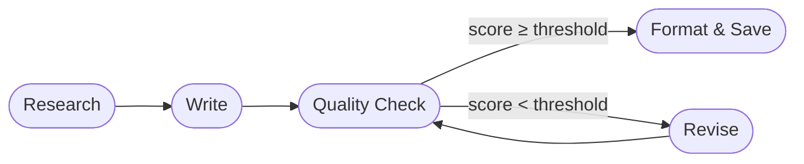
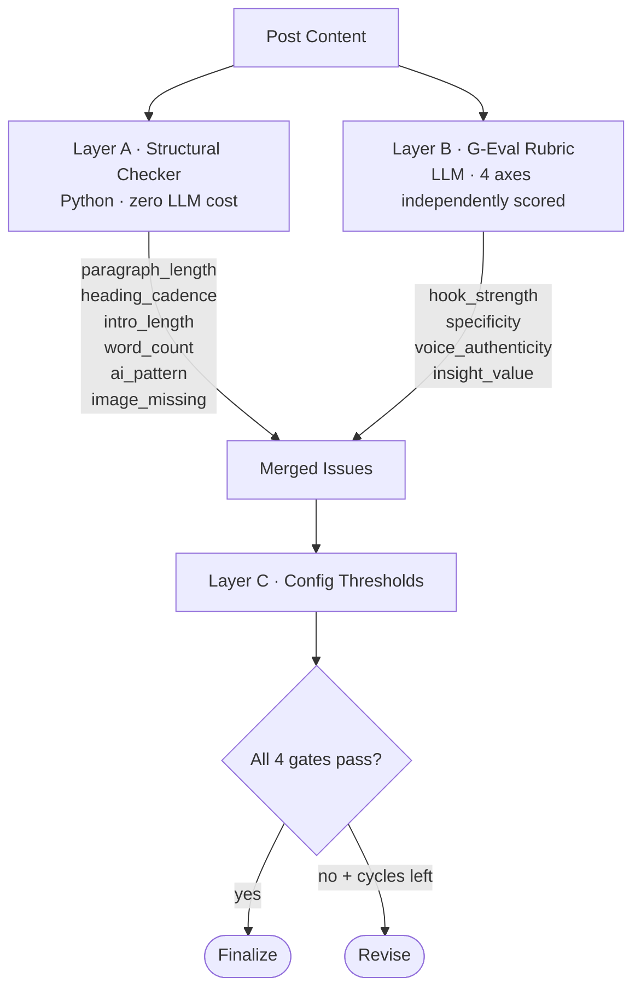
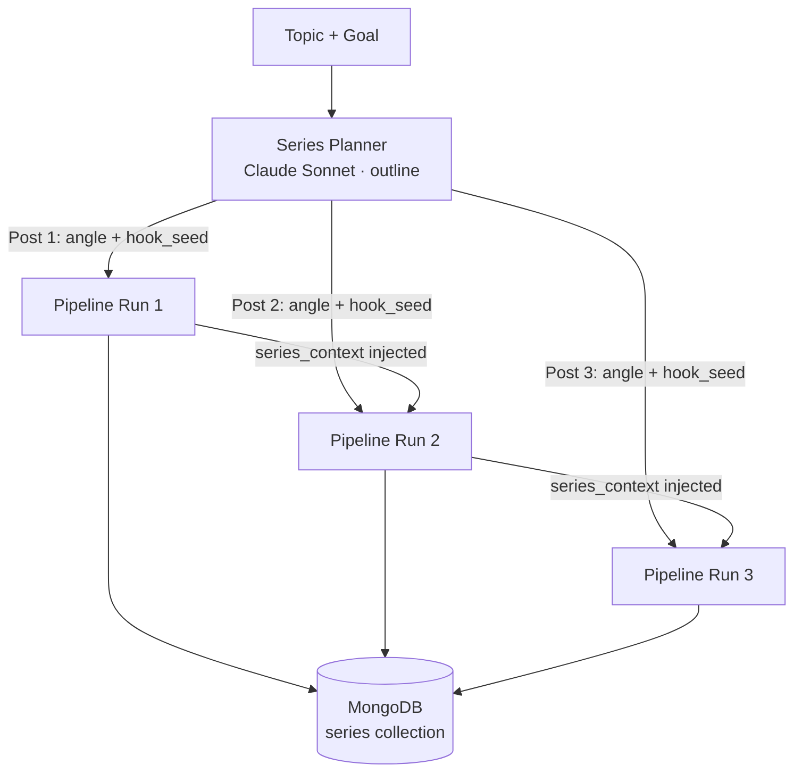
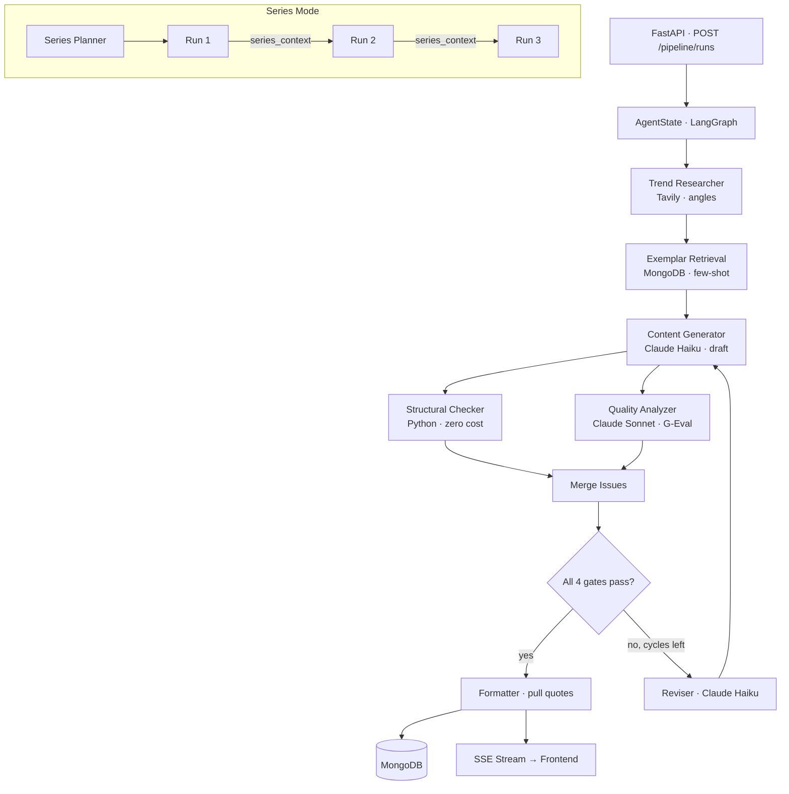
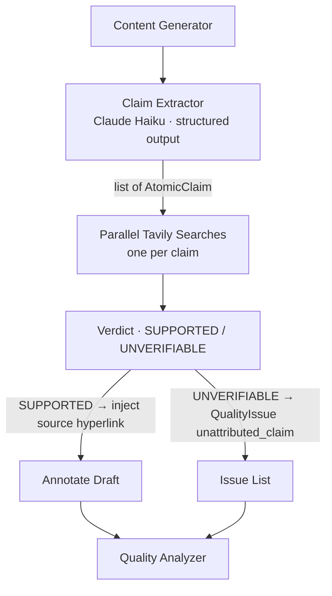

# Medium Agent Factory

[](https://github.com/GatoProgramador-01/medium-agent-factory/actions/workflows/ci.yml)
[](https://github.com/GatoProgramador-01/medium-agent-factory/actions/workflows/eval.yml)
[](https://www.python.org/)

> A LangGraph multi-agent pipeline that writes, scores, fact-checks, and iteratively revises Medium posts until they meet the exact criteria Medium's Boost curators use — source-backed numbers, no AI patterns, and a 1,300-word floor.

---

## The Problem

Every developer who's tried to use AI to write technical blog posts runs into the same wall.

The draft looks fine. The grammar is clean. The structure is solid. But read it back — really read it — and you notice: the statistics are suspiciously round. The numbers don't have sources. Sentences begin with "Moreover" and "Furthermore." The hook announces the topic instead of opening mid-action. And the word count is 1,062, not the 1,300 that Medium's Partner Program needs to maximize earnings.

You could fix it by hand. You could prompt GPT to "make it longer." But that just gives you more of the same prose — AI writing about AI, in the style of AI, citing AI-generated statistics that may or may not exist.

The question is: can a pipeline of specialized agents, each holding the other accountable, produce content that passes a human curator's review?

This project is the answer.

---

## The Story

### Act 1 — A Pipeline Is Born

The first version was three nodes in a LangGraph graph: **Write → Quality → Revise**. A writer agent drafted a post, a quality agent scored it, and a reviser agent fixed it. If the score crossed a threshold, a formatter cleaned it up and saved it to MongoDB.

Simple. But the quality gate was a black box — a list of penalty weights applied to detected issues, with magic numbers like `0.12` for a HIGH issue and `0.05` for a MEDIUM. The reviser didn't know *why* it was failing. It just knew the score was 0.63 and tried again.



This worked — until it didn't. Posts passed quality gates at 1,062 words. The threshold was `min_word_count = 1000`. The content score was 1.0. Nobody flagged anything. The reviser had no motivation to add 300 words because it had no instruction to do so.

### Act 2 — Quality as Code

The second sprint turned intuition into deterministic rules.

The key insight: quality checks split cleanly into two worlds. **Structural metrics** are pure computation — you don't need a language model to count sentences per paragraph or measure the gap between two headings. **Content quality** needs an LLM, but it needs a rubric, not magic weights.



**Layer A** catches deterministic structural problems — zero LLM cost, zero variability:
- Paragraphs over 4 full sentences flagged as `paragraph_length`
- Heading gaps over 500 words flagged as `heading_cadence`
- Intros over 110 words flagged as `intro_length`
- Forbidden AI phrases ("delve", "tapestry", "Moreover") flagged as `ai_pattern`
- Posts under 1,300 words flagged as `word_count`

**Layer B** uses G-Eval (EMNLP 2023) — the LLM scores 4 axes independently on a 0.0–1.0 rubric:

| Axis | 1.0 | 0.0 |
|------|-----|-----|
| `hook_strength` | Specific outcome (number, dollar, failure) in sentence 1 before word 15 | No hook at all |
| `specificity` | 3+ named data points (company names, dates, amounts with source) | Fully abstract, zero concrete anchors |
| `voice_authenticity` | Contractions throughout, personal anecdote with named detail, no AI hedging | Multiple forbidden phrases, zero personal voice |
| `insight_value` | Non-obvious claim + concession + specific prediction | Zero original insight |

`content_score = mean(hook_strength, specificity, voice_authenticity, insight_value)`

No more magic penalties. The LLM reasons about each axis independently — calibrated, explainable, easy to tune.

**Layer C** holds the gates in config:

| Gate | Threshold | What it blocks |
|------|-----------|----------------|
| Gate 1 · Content quality | `min_quality_score = 0.70` | Weak hook, generic voice, no insight |
| Gate 2 · Read ratio | `min_read_ratio = 0.65` | Predicted 30-second read rate below "Strong" |
| Gate 3 · AI patterns | `block_high_ai_patterns = True` | Any HIGH-severity forbidden phrase |
| Gate 4 · Word count | `min_word_count = 1300` | Below Partner Program minimum |

`max_revision_cycles = 6` — the pipeline gets 6 shots before it finalizes whatever it has.

### Act 3 — The Series Machine

The third capability was *continuity*. A single post is fine. A three-post series that reads like chapters of the same guide — where each post knows what the previous one covered and opens with a different angle — is what earns readers who follow the author.



The series planner drafts a 3–5 post series outline. Each entry gets a unique `angle` and a `hook_seed` — a single sentence handed to the writer as the first thing to write: specific, grounded, no topic announcement.

Each subsequent run injects `series_context` into the writer's prompt: what the previous posts covered, what *not* to repeat, and which concepts to build on. The result is a guide that actually reads like a guide.

**Validation run — DeepSeek cost savings series (June 2026):**

| Post | Words | Content Score | Boost Eligible | Revisions |
|------|-------|---------------|----------------|-----------|
| 1 | 1,356 | 1.00 | ✓ | 2 |
| 2 | 1,302 | 1.00 | ✓ | 6 |
| 3 | 1,363 | 1.00 | ✓ | 2 |

All three passed. Post 2 hit 6 revisions and barely cleared 1,302 words — the diminishing-increment problem when content score is already 1.0 and only word count fails. That's a known issue, tracked.

---

## Current Architecture



### Tech Stack

| Layer | Technology |
|-------|-----------|
| Orchestration | LangGraph (StateGraph) |
| LLM — supervisor | Claude Sonnet 4.6 |
| LLM — workers | Claude Haiku 4.5 |
| LLM — optional | DeepSeek V3 / Ollama (local) |
| Web research | Tavily Search API |
| Storage | MongoDB (Motor async) |
| API | FastAPI + Server-Sent Events |
| Frontend | Next.js 14 + Tailwind CSS |
| Prompts | Git-versioned `.txt` files |
| Config | Pydantic Settings (env vars) |

---

## Quality Snapshot Analytics

Every quality check — pass or fail — writes a snapshot to MongoDB's `quality_snapshots` collection. This accumulates a dataset of which issue categories persist across revision cycles and which revision prompts are most effective.

```json
{
  "run_id": "abc-123",
  "iteration": 2,
  "score": 0.74,
  "passed": false,
  "gate_failures": ["word_count"],
  "issue_summary": { "high": 0, "medium": 1, "low": 1, "total": 2 },
  "issues": [
    { "severity": "LOW", "category": "word_count", "location": "full post", "suggestion": "..." }
  ],
  "topic": "DeepSeek cost savings",
  "series_id": "ce30bf36"
}
```

Query example — which categories block posts most often:
```javascript
db.quality_snapshots.aggregate([
  { $unwind: "$issues" },
  { $group: { _id: "$issues.category", count: { $sum: 1 } } },
  { $sort: { count: -1 } }
])
```

---

## Test Suite

116 tests, all passing. TDD throughout — every feature started with a failing test.

```
tests/
├── test_routing.py              # route_after_quality — pure logic, no LLM
├── test_structural_checker.py   # 19 tests · paragraph, heading, intro, word count, phrases
├── test_quality_snapshot.py     # MongoDB snapshot persistence + structural integration
├── test_prompt_refinements.py   # G-Eval rubric presence, category name canonicalization
├── test_validators.py           # Pydantic unicode-normalizer coerce fix
├── test_formatter.py            # Pull quote extraction, formatting rules
├── test_series_context.py       # Series planner output, continuity injection
├── test_llm_factory.py          # get_llm() routing (Anthropic / DeepSeek / Ollama)
├── test_prompt_loader.py        # Prompt file loading and caching
└── e2e/
    └── test_api.py              # Real FastAPI + real MongoDB
```

---

## Sprint History

| Sprint | What shipped |
|--------|-------------|
| 1 · Core pipeline | Write → Quality → Revise → Format loop with LangGraph |
| 2 · Quality v1 | Penalty weight scoring system |
| 3 · Series mode | Series planner, `series_context` injection, continuity |
| 4 · Read ratio | Predicted 30-sec read rate as a separate gate |
| 5 · Quality redesign | Structural checker (Layer A) + G-Eval rubric (Layer B) + config gates (Layer C) |
| 6 · Word count fix | `min_word_count` raised 1000 → 1300, validated with DeepSeek series |
| **7 · Source reliability** | **FactChecker agent — claim extraction + Tavily verification + hyperlink injection** |

---

## Sprint 7 — Source Reliability

### The Problem

The pipeline produces content with statistics and dollar amounts that look authoritative but have no verifiable source. This violates the AP Stylebook rule that every percentage, dollar figure, and survey result needs a named primary source. It also means content can contain hallucinated numbers — research shows LLM hallucination rates on numeric claims are in the **critical** category, with LLMs producing round numbers (50%, $1B, 3×) at 3.7× the rate of factual writing ([UC Berkeley hallucination research](https://arxiv.org/html/2504.17550v1)).

RAG-grounded verification pipelines cut hallucinations by 59% versus fully autonomous generation ([ACM FAccT 2024](https://arxiv.org/html/2412.15189v3)). The intervention is targeted Tavily search per claim — approximately $0.001 per check.

### The Architecture

A new `fact_checker.py` agent runs as a LangGraph node **after the writer, before quality analysis**. It extracts every factual claim, searches for evidence in parallel, and injects results as structured `QualityIssue` entries.



**Claim types extracted:** statistics · percentages · dollar amounts · dates · company claims · product names

**Verdict labels** (mirrors [production citation systems](https://arxiv.org/html/2511.16198v1)):
- `SUPPORTED` — Tavily snippet entails the claim → source URL injected as hyperlink in the draft
- `UNVERIFIABLE` — no Tavily result entails the claim → `QualityIssue(severity="HIGH", category="unattributed_claim")`

**Medium citation format** (hyperlinked anchor text — [best for reader experience on Medium](https://medium.com/@bjdixon/citations-and-footnotes-on-medium-3713cc665722)):
```markdown
According to [Anthropic's 2025 pricing page](https://anthropic.com/pricing), Claude Haiku costs $0.25 per million input tokens.
```

### Files Touched (TDD order)

| Step | File | Action |
|------|------|--------|
| RED | `tests/test_fact_checker.py` | Write failing tests first |
| GREEN | `app/models/post.py` | Add `AtomicClaim`, `VerificationResult` |
| GREEN | `app/agents/fact_checker.py` | Implement extractor + verifier |
| GREEN | `prompts/claim_extractor_system.txt` | Extraction prompt |
| WIRE | `app/agents/orchestrator.py` | Add `fact_check_node` after writer |
| CONFIG | `app/config.py` | Add `fact_check_enabled: bool = True` |

### Success Criteria

- Every HIGH-risk claim (statistic, dollar amount, percentage) in a published post has a Tavily-verified source with a hyperlink
- `UNVERIFIABLE` claims route to the reviser, which drops or replaces them with first-person observations
- Parallel Tavily calls — no sequential latency penalty
- Claim extractor uses Claude Haiku (same worker tier — no new model cost)

---

## Getting Started

```bash
# 1. Clone and install
cd backend
python -m venv .venv
.\.venv\Scripts\activate    # Windows
pip install -e ".[dev]"

# 2. Configure
cp .env.example .env
# Set: ANTHROPIC_API_KEY, TAVILY_API_KEY, MONGODB_URI

# 3. Run the server (Windows PowerShell)
Start-Process -FilePath ".\.venv\Scripts\python.exe" `
  -ArgumentList "-m", "uvicorn", "app.main:app", "--port", "8000", "--reload" -NoNewWindow

# 4. Run tests
pytest tests/ -v

# 5. Generate a single post
curl -X POST http://localhost:8000/pipeline/runs \
  -H "Content-Type: application/json" \
  -d '{"custom_topic": "Why DeepSeek V3 cut our inference costs by 73% — with real numbers from 30 days of production logs"}'

# 6. Generate a series
curl -X POST http://localhost:8000/series \
  -H "Content-Type: application/json" \
  -d '{"topic": "LLM cost optimization guide for agent developers", "num_posts": 3}'
```

### Alternative LLM backends

```bash
# Local (zero API cost) via Ollama
USE_LOCAL_LLM=true LOCAL_LLM_MODEL=llama3.2 uvicorn app.main:app

# DeepSeek V3 (cheap cloud inference)
USE_DEEPSEEK=true DEEPSEEK_API_KEY=sk-... uvicorn app.main:app
```

---

## Environment Variables

| Variable | Default | Description |
|----------|---------|-------------|
| `ANTHROPIC_API_KEY` | — | Required unless `USE_LOCAL_LLM=true` or `USE_DEEPSEEK=true` |
| `TAVILY_API_KEY` | — | Web research + fact-checking (skips gracefully when absent) |
| `MONGODB_URI` | `mongodb://localhost:27017` | MongoDB connection |
| `MIN_QUALITY_SCORE` | `0.70` | G-Eval content score gate |
| `MIN_READ_RATIO` | `0.65` | Predicted 30-sec read rate gate |
| `MIN_WORD_COUNT` | `1300` | Partner Program word count minimum |
| `MAX_REVISION_CYCLES` | `6` | Max revisions before forced finalize |
| `USE_LOCAL_LLM` | `false` | Route all LLM calls to Ollama |
| `USE_DEEPSEEK` | `false` | Route all LLM calls to DeepSeek |
| `FACT_CHECK_ENABLED` | `true` | Run claim verification (Sprint 7) |

---

## Project Structure

```
medium-agent-factory/
├── backend/
│   ├── app/
│   │   ├── agents/
│   │   │   ├── orchestrator.py        ← LangGraph pipeline definition
│   │   │   ├── content_generator.py   ← writer agent
│   │   │   ├── quality_analyzer.py    ← G-Eval rubric (Layer B)
│   │   │   ├── structural_checker.py  ← deterministic checks (Layer A)
│   │   │   ├── fact_checker.py        ← Sprint 7 · claim verification
│   │   │   ├── series_planner.py      ← series outline + hook seeds
│   │   │   ├── web_researcher.py      ← Tavily trend research
│   │   │   ├── read_ratio_analyzer.py ← predicted read rate
│   │   │   ├── exemplar_store.py      ← few-shot exemplars
│   │   │   └── llm_factory.py         ← get_llm(role) — single config point
│   │   ├── models/post.py             ← QualityReport, QualityIssue, AtomicClaim
│   │   ├── routers/
│   │   │   ├── pipeline.py            ← POST /pipeline/runs + SSE stream
│   │   │   ├── posts.py               ← GET /posts
│   │   │   ├── series.py              ← POST /series
│   │   │   └── analytics.py           ← quality_snapshots aggregations
│   │   ├── config.py                  ← Pydantic Settings
│   │   ├── database.py                ← Motor async client
│   │   └── prompt_loader.py           ← git-versioned prompt cache
│   ├── prompts/
│   │   ├── quality_analyzer_system.txt
│   │   ├── content_generator_system.txt
│   │   ├── reviser_system.txt
│   │   └── claim_extractor_system.txt ← Sprint 7
│   └── tests/                         ← 116 tests · TDD throughout
├── frontend/                          ← Next.js 14 dashboard
└── README.md
```
