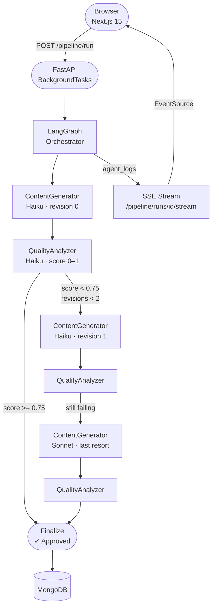

# medium-agent-factory

A production-grade LLM pipeline that generates, evaluates, and revises Medium posts automatically. Built as a hands-on LLMOps portfolio project — every production pattern was built, broken, debugged, and documented week by week.

> **The meta story:** the three posts in `/posts` were written by this pipeline about this pipeline.

---

## What it does

1. You give it a topic
2. A **ContentGenerator** agent (Claude Haiku) writes a full 1500-word post
3. A **QualityAnalyzer** agent scores it from 0–1 on human-likeness, readability, and structure
4. If the score is below 0.75, the pipeline revises — up to 2 times, escalating to Claude Sonnet on the last attempt
5. The approved post lands in MongoDB with a full quality report, issue list, and cost breakdown

Live agent logs stream to the browser via Server-Sent Events while the pipeline runs.

---

## Architecture



### Cost model (per post)

| Path | Models used | Approx cost |
|---|---|---|
| Passes first try | Haiku × 2 | ~$0.005 |
| One revision | Haiku × 4 | ~$0.012 |
| Sonnet last resort | Haiku × 4 + Sonnet × 2 | ~$0.035 |

Compare to always-Sonnet: **~$0.05/post** — worst case is still 30% cheaper.

---

## LLMOps patterns built week by week

| Week | Pattern | Why it matters |
|---|---|---|
| 1 | **3-layer eval pipeline** | CI gate catches prompt regressions before merge |
| 2 | **Ollama local LLM switch** | One env var swaps the whole pipeline to a free local model |
| 2 | **SSE streaming** | Browser receives live agent logs — no polling |
| 3 | **Prompt versioning** | Prompts are `.txt` files in git; any change triggers the eval gate |
| 4 | **LangChain retry + tenacity** | Transient Anthropic errors retry with exponential backoff |

---

## Stack

**Backend:** FastAPI · LangChain · LangGraph · Claude (Haiku / Sonnet) · MongoDB (Motor) · LangSmith  
**Frontend:** Next.js 15 · React 19 · TypeScript · Tailwind CSS · Recharts  
**Infra:** Docker Compose · GitHub Actions CI  
**Local LLM:** Ollama (opt-in via `USE_LOCAL_LLM=true`)

---

## Quick start

### Prerequisites
- Python 3.11+
- Node 18+
- MongoDB running on `localhost:27017`
- An [Anthropic API key](https://console.anthropic.com)

### 1. Clone and configure

```bash
git clone https://github.com/GatoProgramador-01/medium-agent-factory
cd medium-agent-factory
cp .env.example .env
# Edit .env — add ANTHROPIC_API_KEY at minimum
```

### 2. Backend

```bash
cd backend
python -m venv .venv
.venv/Scripts/activate        # Windows
# source .venv/bin/activate   # Mac/Linux
pip install -e ".[dev]"
uvicorn app.main:app --reload
# → http://localhost:8000
```

### 3. Frontend

```bash
cd frontend
npm install
npm run dev
# → http://localhost:3000
```

### 4. Run the pipeline

Open `http://localhost:3000/pipeline`, type a topic, hit **run_pipeline**.  
Or via curl:

```bash
curl -X POST http://localhost:8000/pipeline/run \
  -H "Content-Type: application/json" \
  -d '{"custom_topic": "how I cut my LLM costs to zero with Ollama"}'
```

---

## Docker Compose (optional)

```bash
# Standard stack (backend + frontend, MongoDB on host)
docker compose up

# With local Ollama LLM (no Anthropic calls)
docker compose --profile local-llm up
docker compose exec ollama ollama pull llama3.2
# Then set USE_LOCAL_LLM=true in .env and restart backend
```

---

## Eval pipeline

Quality regressions are caught in CI before they merge.

```bash
# Run CI gate locally (Layer 1 + 2, ~$0.04, ~2 min)
cd backend
pytest evals/ -v -m "not eval_deep"

# Run nightly deep evals (LLM-as-judge)
pytest evals/ -v -m eval_deep

# Visual diff in LangSmith
python -m evals.langsmith_eval "my-experiment-name"
```

Three eval layers:

| Layer | What it checks | When it runs |
|---|---|---|
| Score direction | Good posts score ≥ 0.70, bad posts ≤ 0.55 | Every PR |
| Cohort mean | Mean scores don't drift from baseline | Every PR |
| LLM-as-judge | Revision prompts are specific and actionable | Nightly |

CI triggers on changes to `app/agents/**`, `prompts/**`, or `evals/**`.

---

## Project structure

```
medium-agent-factory/
├── backend/
│   ├── app/
│   │   ├── agents/
│   │   │   ├── llm_factory.py      ← get_llm(role) — provider switch via env var
│   │   │   ├── retry.py            ← LangChain + tenacity retry patterns
│   │   │   ├── orchestrator.py     ← LangGraph pipeline graph
│   │   │   ├── content_generator.py
│   │   │   └── quality_analyzer.py
│   │   ├── routers/
│   │   │   ├── pipeline.py         ← SSE stream endpoint
│   │   │   ├── posts.py
│   │   │   └── analytics.py
│   │   ├── prompt_loader.py        ← reads prompts/ at startup, caches in dict
│   │   └── config.py
│   ├── prompts/                    ← all LLM prompts as .txt files (git-versioned)
│   │   ├── quality_analyzer_system.txt
│   │   ├── content_generator_system.txt
│   │   └── ...
│   └── evals/
│       ├── datasets/
│       │   └── quality_analyzer.jsonl   ← 20 curated test cases
│       ├── conftest.py             ← fixtures + MongoDB mock
│       └── test_quality_analyzer.py
├── frontend/
│   └── src/app/
│       ├── pipeline/page.tsx       ← SSE EventSource live log terminal
│       ├── posts/page.tsx
│       └── analytics/page.tsx
├── .github/workflows/
│   └── eval.yml                   ← CI gate (path-filtered, runs on PR)
└── docker-compose.yml             ← includes ollama profile
```

---

## Configuration reference

| Variable | Default | Description |
|---|---|---|
| `ANTHROPIC_API_KEY` | required | Anthropic API key |
| `MONGODB_URI` | `mongodb://localhost:27017` | MongoDB connection string |
| `SUPERVISOR_MODEL` | `claude-sonnet-4-6` | Model for quality revisions (last resort) |
| `WORKER_MODEL` | `claude-haiku-4-5-20251001` | Model for initial generation |
| `MIN_QUALITY_SCORE` | `0.75` | Score threshold before a post is approved |
| `MAX_REVISION_CYCLES` | `2` | Max revisions before forced approval |
| `USE_LOCAL_LLM` | `false` | Route entire pipeline to Ollama |
| `LOCAL_LLM_MODEL` | `llama3.2` | Ollama model to use |
| `LOCAL_LLM_BASE_URL` | `http://ollama:11434` | Ollama endpoint |
| `LANGCHAIN_TRACING_V2` | `false` | Enable LangSmith tracing |
| `LANGCHAIN_API_KEY` | — | LangSmith API key |
| `LANGCHAIN_PROJECT` | `medium-agent-factory` | LangSmith project name |

---

## API reference

| Method | Path | Description |
|---|---|---|
| `POST` | `/pipeline/run` | Trigger pipeline (async, returns `run_id`) |
| `GET` | `/pipeline/runs/{id}` | Get run status |
| `GET` | `/pipeline/runs/{id}/stream` | SSE live log stream |
| `GET` | `/posts` | List all posts |
| `GET` | `/posts/{run_id}` | Get post with full quality report |
| `GET` | `/analytics/token-usage` | Per-agent token + cost breakdown |
| `GET` | `/analytics/summary` | Overall stats |

Full interactive docs: `http://localhost:8000/docs`

---

## The posts this pipeline wrote about itself

After Week 2 was complete, the pipeline was asked to write about what it had just built:

- **"How I Built a Self-Evaluating LLM Pipeline That Blocks Bad AI Writing"** — score 0.82
- **"LLMOps Skills That Will Actually Get You Hired in 2025"** — score 0.82  
- **"One Environment Variable Killed My LLM API Bills"** — score 0.82

All three passed the quality gate on the first attempt with zero revisions. The quality analyzer's top feedback on all three: section headers were slightly too formulaic. The pipeline diagnosed its own output correctly.

---

## Roadmap

- [ ] Cheap production deploy (Railway + Vercel + MongoDB Atlas)
- [ ] Redis response cache — skip API call for identical prompts
- [ ] Prompt A/B testing — run two prompt versions against the same eval set, pick the winner
- [ ] LangGraph human-in-the-loop — pause before publishing for human review
