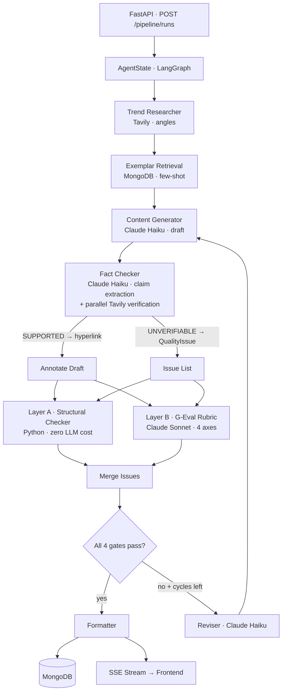
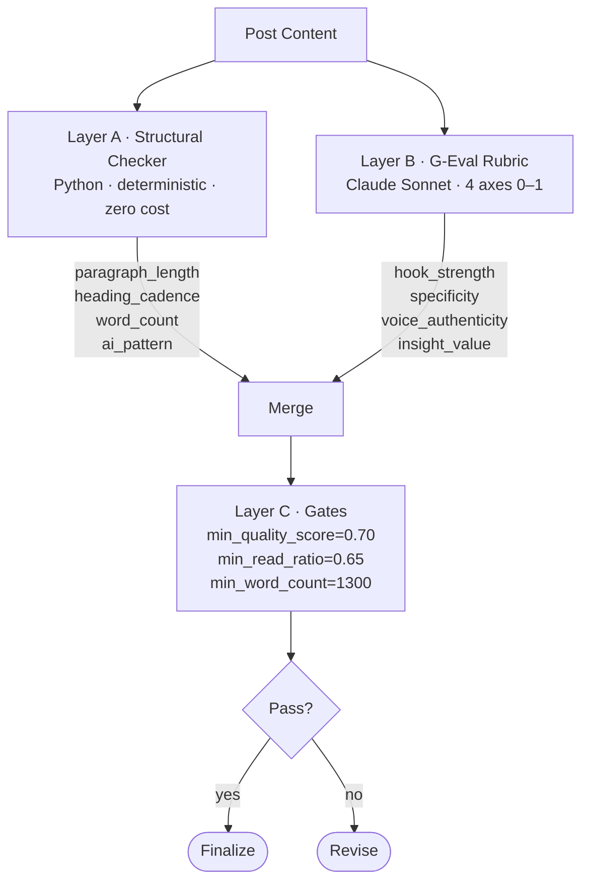

<div align="center">

# Medium Agent Factory

[](https://github.com/GatoProgramador-01/medium-agent-factory/actions/workflows/ci.yml)
[](https://github.com/GatoProgramador-01/medium-agent-factory/actions/workflows/eval.yml)
[](https://www.python.org/)
[](https://www.typescriptlang.org/)
[](https://nextjs.org/)
[](https://www.mongodb.com/atlas)
[](https://langchain.com/)
[](LICENSE)

**A LangGraph multi-agent pipeline that researches, writes, fact-checks, and iteratively revises Medium posts until every quality gate passes — source-backed claims, no AI patterns, and a 1,300-word floor.**

[Live Demo](https://medium-agent-factory.vercel.app) &nbsp;|&nbsp; Backend hosted on Railway &nbsp;|&nbsp; [View Source](https://github.com/GatoProgramador-01/medium-agent-factory)

</div>

---

## The Problem

Every developer who has tried to automate technical blog writing runs into the same wall. The draft looks fine. The grammar is clean. But read it back — really read it — and you notice: the statistics are suspiciously round, the numbers have no sources, sentences begin with "Moreover" and "Furthermore," and the hook announces the topic instead of opening mid-action. The word count is 1,062, not the 1,300 the Medium Partner Program requires. You could fix it by hand, but that defeats the purpose. You could prompt the model to "make it better," but that produces more of the same — AI writing about AI, in the style of AI, citing AI-generated figures that may or may not exist.

The real question is: can a pipeline of specialized agents, each holding the others accountable, produce content that passes a human curator's review?

This project is the answer.

---

## Live Demo

[Live Demo](https://medium-agent-factory.vercel.app) — frontend on Vercel, backend FastAPI on Railway, database on MongoDB Atlas (free M0).

> Note: the live instance uses the free tier. Cold starts on the Railway backend may take 10–15 seconds on first request.

---

## How It Works — The Story Arc

### Act 1 — A Pipeline Is Born

The first version was three nodes in a LangGraph graph: **Write → Quality → Revise**. A writer agent drafted a post, a quality agent scored it, and a reviser fixed it. If the score crossed a threshold, a formatter cleaned it and saved it to MongoDB. Simple — but the quality gate was a black box of penalty weights with magic numbers like `0.12` for HIGH and `0.05` for MEDIUM. The reviser had no idea why it was failing. It just knew the score was 0.63 and tried again.

### Act 2 — Quality as Code

The second act turned intuition into deterministic rules. The key insight: quality checks split cleanly into two worlds. Structural metrics — sentence length, heading gaps, word count, forbidden phrases — are pure computation. Content quality needs a language model, but it needs a rubric, not magic weights. That rubric is G-Eval (EMNLP 2023): the LLM scores four axes independently on a 0.0–1.0 scale. No more black box. Every gate lives in config. Every revision gets a structured reason, not just a score.

### Act 3 — The Series Machine

A single well-written post is fine. A three-post series that reads like chapters of the same guide — each opening from a different angle, never repeating what the previous one covered — is what earns readers who follow the author. The series planner drafts an outline. Each run injects `series_context`: what was covered, what not to repeat, what to build on. The result is continuity, not repetition.

**Validation run — DeepSeek cost savings series (June 2026):**

| Post | Words | Content Score | Boost Eligible | Revisions |
|------|-------|---------------|----------------|-----------|
| 1 | 1,356 | 1.00 | yes | 2 |
| 2 | 1,302 | 1.00 | yes | 6 |
| 3 | 1,363 | 1.00 | yes | 2 |

---

## Editorial Monetization Roadmap

The next phase is not "generate more posts." The next phase is to turn real
software projects into evidence-backed posts, guides, and series that can earn
reader trust on Medium.

Medium rewards direct experience, useful explanation, strong narrative, and
specific evidence. For this project, the most valuable source material is not a
generic AI topic. It is a working repository with scars: architecture decisions,
failed runs, test output, performance numbers, debugging notes, and code that
actually shipped.

The first flagship case study is
[`GatoProgramador-01/pj-peru-scraper`](https://github.com/GatoProgramador-01/pj-peru-scraper):
a real scraper for Peruvian judiciary portals with HTTP-only scraping, JSF
ViewState edge cases, soft-block detection, PDF downloads, checkpointing,
parallel workers, tests, and concrete runtime metrics.

### Target Publishing Modes

| Mode | Goal | Best For | Output |
|------|------|----------|--------|
| Post Mode | One strong argument with a clear hook | Lessons learned, failure stories, launches | 1,400-1,800 word Medium post |
| Guide Mode | Teach the reader how to build or debug something end-to-end | Architecture walkthroughs, scraping guides, LLMOps patterns | Deep technical tutorial with commands, code, screenshots, and gotchas |
| Series Mode | Build repeat readership and follow-through | Complex repos like `pj-peru-scraper` | 4-7 connected posts with continuity and non-repetition |

### New Agent Roadmap

| Agent | Purpose | Why It Matters for Revenue |
|-------|---------|----------------------------|
| `RepoAnalyzer` | Reads README, package files, tests, scripts, modules, and commit history to extract the real project story | Prevents generic posts by grounding every article in real evidence |
| `RunbookExecutor` | Runs safe local commands, tests, dry-runs, benchmarks, and captures outputs | Turns claims into verifiable proof readers can trust |
| `EvidenceWeaver` | Converts logs, metrics, code paths, and failure notes into publishable narrative | Makes the writing feel first-hand instead of AI-generated |
| `GuidePlanner` | Decides whether a topic should become a post, guide, or series | Optimizes for reader intent and follow potential |
| `CodeSnippetCurator` | Selects short, explainable snippets and avoids dumping large code blocks | Improves technical clarity and read ratio |
| `SeriesContinuityEditor` | Maintains callbacks, progression, and non-repetition across a series | Creates repeat readership instead of isolated posts |
| `MediumMoneyEvaluator` | Scores Boost fit, reader value, follow potential, AI-policy risk, and publication fit | Keeps the system focused on posts that can actually earn |
| `PublicationPitcher` | Produces publication-specific pitch notes and submission strategy | Increases distribution odds beyond self-publishing |

### Sprint Plan

#### Sprint M1: Evidence-First Repo Analysis

- Add `RepoAnalyzer` for local and GitHub repositories.
- Extract project purpose, stack, architecture, commands, tests, scripts, notable
  files, metrics, and unresolved risks.
- Produce an `EvidenceBrief` document stored in MongoDB and usable by all writer
  agents.
- First target: `pj-peru-scraper`.

Success criteria:

- The system can explain what the repo does without hallucinating.
- Every numeric claim in a generated post traces back to repo evidence, run
  output, or explicit user-provided context.

#### Sprint M2: Runbook and Local Proof

- Add `RunbookExecutor` with safe command allowlists.
- Run tests, lint, dry-runs, sample scraper commands, and benchmark scripts when
  available.
- Capture stdout/stderr summaries, durations, pass/fail status, and artifact
  paths.
- Store `RunEvidence` records linked to the post or series run.

Success criteria:

- The post generator can cite local test output and measured runtime.
- Failed commands become story material and debugging notes, not silent errors.

#### Sprint M3: Guide Mode

- Add `GuidePlanner` and a guide-specific prompt set.
- Generate tutorial structures with prerequisites, setup, commands, expected
  output, failure modes, and "why this design" sections.
- Add `CodeSnippetCurator` to select compact snippets from real files.

Success criteria:

- The system can produce a complete technical guide from `pj-peru-scraper`
  without inventing architecture or commands.
- Code snippets are short, contextual, and linked to source files.

#### Sprint M4: Series Mode for Real Projects

- Upgrade current series planning into a project-aware editorial arc.
- Add `SeriesContinuityEditor` to track what each post already explained.
- Generate 4-7 post series plans from one evidence brief.

Candidate `pj-peru-scraper` series:

1. The HTTP 200 That Lied: detecting soft-blocks in legacy portals.
2. Why HTTP-only scraping beat browser automation.
3. The 7-layer scraper architecture.
4. Concurrency, checkpointing, and avoiding 429s.
5. Testing a scraper against hostile legacy systems.
6. How Claude Code helped, where it failed, and the control plane that fixed it.

Success criteria:

- Each post has a distinct promise and no repeated setup.
- The series creates a natural follow path for readers.

#### Sprint M5: Medium Money Evaluator

- Add a scoring agent focused on monetization signals: direct experience,
  practical utility, specificity, originality, read ratio, Boost fit,
  publication fit, and AI-policy risk.
- Add a "publish / revise / hold" verdict.
- Add title, subtitle, CTA, and publication pitch recommendations.

Success criteria:

- The pipeline does not approve posts that are merely well-written.
- Approval requires credible earning potential and low AI-policy risk.

#### Sprint M6: DeepSeek Cost and LangSmith Observability

- Update DeepSeek model defaults and pricing tables.
- Fix token accounting for OpenAI-compatible usage metadata: `usage`,
  `token_usage`, and `AIMessage.usage_metadata`.
- Add LangSmith metadata tags for provider, model, run_id, series_id, agent, and
  editorial mode.
- Show per-post estimated cost, latency, revision count, and quality deltas in
  analytics.

Success criteria:

- Every generated post has an estimated cost and trace link.
- DeepSeek can be compared against Claude for quality, latency, and cost.

#### Sprint M7: Publish-Ready Export

- Add an export step for Medium-ready Markdown.
- Include title, subtitle, canonical tags, image briefs, source list, disclosure
  note when AI assistance should be disclosed, and publication pitch.
- Add a final human checklist before paywall submission.

Success criteria:

- The final artifact can be pasted into Medium with minimal editing.
- The system flags claims that need manual verification before publication.

---

## Architecture

### Full Pipeline



### Quality Architecture



---

## Quality Gates

All four must pass before the post is finalized. Any failure routes to the reviser for another cycle. Maximum cycles: 6.

| Gate | Config Key | Threshold | What It Blocks |
|------|-----------|-----------|----------------|
| Gate 1 · Content quality | `min_quality_score` | `0.70` | Weak hook, generic voice, no insight |
| Gate 2 · Read ratio | `min_read_ratio` | `0.65` | Predicted 30-second read rate below "Strong" |
| Gate 3 · AI patterns | `block_high_ai_patterns` | `true` | Any HIGH-severity forbidden phrase |
| Gate 4 · Word count | `min_word_count` | `1300` | Below Medium Partner Program minimum |

---

## G-Eval Axes

`content_score = mean(hook_strength, specificity, voice_authenticity, insight_value)`

Each axis is scored 0.0–1.0 by Claude Sonnet independently. No weighting. No black box.

| Axis | 1.0 Description | 0.0 Description |
|------|----------------|----------------|
| `hook_strength` | Specific outcome (number, dollar amount, failure) in sentence 1 before word 15 | No hook at all; opens with a topic announcement |
| `specificity` | 3+ named data points — company names, dates, amounts with source | Fully abstract; zero concrete anchors |
| `voice_authenticity` | Contractions throughout, personal anecdote with named detail, no AI hedging | Multiple forbidden phrases; zero personal voice |
| `insight_value` | Non-obvious claim + concession + specific prediction | Zero original insight; could have been written by anyone |

---

## Tech Stack

| Layer | Technology |
|-------|-----------|
| Orchestration | LangGraph (StateGraph + conditional edges) |
| LLM — supervisor | Claude Sonnet 4.6 |
| LLM — workers | Claude Haiku 4.5 |
| LLM — optional | DeepSeek V3, Ollama (local) |
| Web research + fact-checking | Tavily Search API |
| Storage | MongoDB Atlas (Motor async driver) |
| API | FastAPI + Server-Sent Events (SSE) |
| Frontend | Next.js 15 + Tailwind CSS |
| Prompts | Git-versioned `.txt` files |
| Config | Pydantic Settings (environment variables) |
| Observability | LangSmith tracing |
| CI/CD | GitHub Actions (5 jobs) |
| Deploy | Railway (backend) + Vercel (frontend) |
| IaC option | Terraform (AWS ECS Fargate) |
| Containerization | Docker + GitHub Container Registry |

---

## LLMOps

### 3-Layer Eval Architecture

Every change to an agent or prompt triggers an eval run in CI before the PR can merge.

| Layer | Cost | Model | Trigger | Gate |
|-------|------|-------|---------|------|
| Layer 1 — Score direction | ~$0.002/case | Claude Haiku | Every PR | Block on fail (accuracy >= 75%) |
| Layer 2 — Batch regression | ~$0.04 total | Claude Haiku | Every PR | Catches calibration drift |
| Layer 3 — LLM-as-judge | ~$0.005/case | Claude Sonnet | Nightly only (`eval_deep` marker) | Advisory |

Layer 1 and 2 run under 5 minutes and under $0.05. Layer 3 runs nightly. The eval workflow triggers on path filters: `backend/app/agents/**`, `backend/prompts/**`, `backend/evals/**`.

### Prompt Versioning

Prompts are code. Every prompt lives in `prompts/` as a `.txt` file, versioned in git, loaded at startup into a module-level cache. No prompt strings inside agent files.

```python
# app/prompt_loader.py
_CACHE: dict[str, str] = {
    p.stem: p.read_text(encoding="utf-8")
    for p in (Path(__file__).parent.parent / "prompts").glob("*.txt")
}
```

Changing a prompt without a test is a CI failure. The eval gate catches regression before it reaches production.

### LangSmith Tracing

All pipeline runs emit traces to LangSmith. Each trace is tagged with `run_id`, `series_id`, `revision_cycle`, and `environment`. Quality scores, gate decisions, and revision reasons are logged as structured metadata — not buried in unstructured text.

### Quality Snapshot Analytics

Every quality check — pass or fail, on every revision cycle — writes a document to MongoDB's `quality_snapshots` collection. This accumulates a dataset of which issue categories persist across cycles and which revision prompts are most effective.

```json
{
  "run_id": "abc-123",
  "iteration": 2,
  "score": 0.74,
  "passed": false,
  "gate_failures": ["word_count"],
  "issue_summary": { "high": 0, "medium": 1, "low": 1, "total": 2 },
  "issues": [
    { "severity": "LOW", "category": "word_count", "location": "full post", "suggestion": "..." }
  ],
  "topic": "DeepSeek cost savings",
  "series_id": "ce30bf36"
}
```

Query to find which issue categories block posts most often:

```javascript
db.quality_snapshots.aggregate([
  { $unwind: "$issues" },
  { $group: { _id: "$issues.category", count: { $sum: 1 } } },
  { $sort: { count: -1 } }
])
```

---

## Test Suite

**306 total — 248 backend + 58 frontend. TDD throughout (Red → Green → Refactor).**

Every feature started with a failing test. No `// TODO: add tests` is committed. The CI pipeline blocks merges if tests fail or coverage drops.

```
backend/tests/
├── test_fact_checker.py          # claim extraction, parallel verification, hyperlink injection
├── test_structural_checker.py    # 19 tests · paragraph, heading, intro, word count, ai_pattern
├── test_quality_snapshot.py      # MongoDB snapshot persistence + structural integration
├── test_routing.py               # route_after_quality — pure logic, zero LLM calls
├── test_prompt_refinements.py    # G-Eval rubric axis presence, category canonicalization
├── test_validators.py            # Pydantic unicode-normalizer coerce fix
├── test_formatter.py             # pull quote extraction, formatting rules
├── test_series_context.py        # series planner output, continuity injection
├── test_llm_factory.py           # get_llm() routing (Anthropic / DeepSeek / Ollama)
├── test_prompt_loader.py         # prompt file loading and caching
└── e2e/
    └── test_api.py               # real FastAPI + real MongoDB (pytest-asyncio)

frontend/src/
└── **/*.test.tsx                 # 58 unit tests · Jest + React Testing Library
```

---

## Quick Start

### Prerequisites

- Python 3.11+
- Node.js 24+
- MongoDB running locally (or a free Atlas cluster)
- API keys: `ANTHROPIC_API_KEY`, `TAVILY_API_KEY`

### Backend

```bash
cd backend
python -m venv .venv

# Windows (Git Bash)
source .venv/Scripts/activate
# macOS / Linux
source .venv/bin/activate

pip install -e ".[dev]"

cp .env.example .env
# Edit .env — set ANTHROPIC_API_KEY, TAVILY_API_KEY, MONGODB_URI

# Start server (Windows PowerShell — avoids Git Bash background process issues)
Start-Process -FilePath ".\.venv\Scripts\python.exe" `
  -ArgumentList "-m", "uvicorn", "app.main:app", "--port", "8000", "--reload" -NoNewWindow

# Run tests
pytest tests/ -v
```

### Frontend

```bash
cd frontend
npm install
cp .env.local.example .env.local
# Set NEXT_PUBLIC_API_URL=http://localhost:8000
npm run dev
```

### Generate a post

```bash
# Single post
curl -X POST http://localhost:8000/pipeline/runs \
  -H "Content-Type: application/json" \
  -d '{"custom_topic": "Why DeepSeek V3 cut our inference costs by 73% — with real numbers from 30 days of production logs"}'

# Watch the SSE stream
curl http://localhost:8000/pipeline/runs/{run_id}/stream

# Generate a 3-post series
curl -X POST http://localhost:8000/series \
  -H "Content-Type: application/json" \
  -d '{"topic": "LLM cost optimization guide for agent developers", "num_posts": 3}'
```

### Docker

```bash
docker compose up --build
```

---

## Alternative LLM Backends

The entire pipeline routes through `get_llm(role)` in `llm_factory.py`. Switching backends requires one environment variable — no changes inside agent files.

```bash
# Local inference via Ollama (zero API cost)
USE_LOCAL_LLM=true LOCAL_LLM_MODEL=llama3.2 uvicorn app.main:app --port 8000

# DeepSeek V3 (low-cost cloud inference)
USE_DEEPSEEK=true DEEPSEEK_API_KEY=sk-... uvicorn app.main:app --port 8000
```

Inside Docker, set `LOCAL_LLM_BASE_URL=http://ollama:11434`. Outside Docker, it defaults to `http://localhost:11434`.

---

## Environment Variables

| Variable | Default | Description |
|----------|---------|-------------|
| `ANTHROPIC_API_KEY` | — | Required unless `USE_LOCAL_LLM=true` or `USE_DEEPSEEK=true` |
| `TAVILY_API_KEY` | — | Web research and fact-checking. Skips gracefully when absent. |
| `MONGODB_URI` | `mongodb://localhost:27017` | MongoDB connection string |
| `MONGODB_DATABASE` | `medium_agent_factory` | Database name (use `_test` suffix in tests) |
| `MIN_QUALITY_SCORE` | `0.70` | G-Eval content score gate |
| `MIN_READ_RATIO` | `0.65` | Predicted 30-second read rate gate |
| `MIN_WORD_COUNT` | `1300` | Partner Program word count minimum |
| `MAX_REVISION_CYCLES` | `6` | Maximum revision attempts before forced finalize |
| `BLOCK_HIGH_AI_PATTERNS` | `true` | Block posts with HIGH-severity AI pattern phrases |
| `FACT_CHECK_ENABLED` | `true` | Run claim extraction and Tavily verification |
| `USE_LOCAL_LLM` | `false` | Route all LLM calls to Ollama |
| `USE_DEEPSEEK` | `false` | Route all LLM calls to DeepSeek |
| `LOCAL_LLM_MODEL` | `llama3.2` | Ollama model name |
| `LOCAL_LLM_BASE_URL` | `http://localhost:11434` | Ollama server URL |
| `LANGCHAIN_TRACING_V2` | `false` | Enable LangSmith tracing |
| `LANGCHAIN_PROJECT` | `medium-agent-factory` | LangSmith project name |

---

## Skills Demonstrated

This project was built as a portfolio piece demonstrating production-grade LLM engineering. Every decision was made with cost, reliability, and observability in mind.

| Skill | Where |
|-------|-------|
| LangGraph stateful multi-agent orchestration with conditional edges | `backend/app/agents/orchestrator.py` |
| G-Eval LLM-as-judge evaluation (EMNLP 2023) — 4 independent axes, 0.0–1.0 rubric | `backend/app/agents/quality_analyzer.py` |
| 3-layer quality architecture: deterministic + LLM rubric + config gates | `backend/app/agents/structural_checker.py`, `quality_analyzer.py`, `config.py` |
| Parallel async fact-checking with Tavily — claim extraction + hyperlink injection | `backend/app/agents/fact_checker.py` |
| SSE streaming from FastAPI to Next.js (no polling, no websocket overhead) | `backend/app/routers/pipeline.py`, `frontend/src/` |
| TDD throughout — 306 tests, Red → Green → Refactor, no retrofitted tests | `backend/tests/`, `frontend/src/**/*.test.tsx` |
| LLMOps: eval-in-CI, 3-layer eval architecture, LangSmith tracing, prompt versioning | `backend/evals/`, `backend/prompts/`, `.github/workflows/eval.yml` |
| Multi-model cost switching — Anthropic / DeepSeek / Ollama, single factory function | `backend/app/agents/llm_factory.py` |
| MongoDB analytics — `quality_snapshots` collection with aggregation pipeline | `backend/app/routers/analytics.py` |
| Docker + GitHub Actions 5-job CI/CD pipeline + Railway/Vercel deploy | `.github/workflows/`, `docker-compose.yml` |

---

## Project Structure

```
medium-agent-factory/
├── backend/
│   ├── app/
│   │   ├── agents/
│   │   │   ├── orchestrator.py        ← LangGraph pipeline definition
│   │   │   ├── content_generator.py   ← writer agent (Claude Haiku)
│   │   │   ├── quality_analyzer.py    ← G-Eval rubric (Layer B)
│   │   │   ├── structural_checker.py  ← deterministic checks (Layer A)
│   │   │   ├── fact_checker.py        ← claim extraction + Tavily verification
│   │   │   ├── series_planner.py      ← series outline + hook seeds
│   │   │   ├── web_researcher.py      ← Tavily trend research
│   │   │   ├── read_ratio_analyzer.py ← predicted 30-sec read rate
│   │   │   ├── exemplar_store.py      ← few-shot exemplar retrieval
│   │   │   └── llm_factory.py         ← get_llm(role) — single model config point
│   │   ├── models/post.py             ← QualityReport, QualityIssue, AtomicClaim
│   │   ├── routers/
│   │   │   ├── pipeline.py            ← POST /pipeline/runs + SSE /stream
│   │   │   ├── posts.py               ← GET /posts
│   │   │   ├── series.py              ← POST /series
│   │   │   └── analytics.py           ← quality_snapshots aggregations
│   │   ├── config.py                  ← Pydantic Settings
│   │   ├── database.py                ← Motor async client singleton
│   │   └── prompt_loader.py           ← startup cache for git-versioned prompts
│   ├── prompts/
│   │   ├── content_generator_system.txt
│   │   ├── quality_analyzer_system.txt
│   │   ├── reviser_system.txt
│   │   ├── series_planner_system.txt
│   │   └── claim_extractor_system.txt
│   ├── evals/                         ← 3-layer eval suite (JSONL datasets)
│   └── tests/                         ← 248 tests, TDD
├── frontend/
│   └── src/
│       ├── components/
│       │   ├── QualityPanel.tsx        ← G-Eval scores + gate pass/fail
│       │   ├── SourcesPanel.tsx        ← verified claim hyperlinks
│       │   ├── RevisionHistoryPanel.tsx ← per-cycle quality snapshots
│       │   └── SeriesNav.tsx           ← series navigation
│       └── app/                        ← Next.js 15 App Router pages
├── infra/                             ← Terraform (AWS ECS Fargate option)
│   ├── modules/
│   └── envs/dev/
├── docker-compose.yml
└── .github/
    └── workflows/
        ├── ci.yml                     ← 5-job pipeline
        ├── eval.yml                   ← eval gate (path-filtered)
        └── deploy.yml                 ← Railway + Vercel on merge
```

---

<details>
<summary>Sprint History (Sprint 1 – Sprint 11+)</summary>

| Sprint | What Shipped |
|--------|-------------|
| 1 | Core LangGraph pipeline: Write → Quality → Revise → Format |
| 2 | Penalty weight quality scoring system (v1 — later replaced) |
| 3 | Series planner, `series_context` injection, multi-post continuity |
| 4 | Read ratio analyzer — predicted 30-second read rate as Gate 2 |
| 5 | Quality redesign: Layer A (structural checker) + Layer B (G-Eval rubric) + Layer C (config gates) |
| 6 | `min_word_count` raised 1000 → 1300; validated with DeepSeek cost savings series (all 3 posts Boost-eligible) |
| 7 | Fact checker agent: claim extraction + parallel Tavily verification + hyperlink injection |
| 8 | SSE streaming: FastAPI event generator → Next.js `EventSource` with `__done__` sentinel |
| 9 | Frontend dashboard: QualityPanel, SourcesPanel, RevisionHistoryPanel, SeriesNav |
| 10 | LLMOps: 3-layer eval architecture, eval-in-CI, LangSmith tracing, prompt versioning |
| 11 | `max_revision_cycles` raised 2 → 6; quality_snapshots MongoDB collection; analytics router |
| 11+ | Multi-model cost switching (DeepSeek / Ollama); Docker + GitHub Container Registry; Railway + Vercel CI/CD deploy |

</details>

---

## License

MIT — see [LICENSE](LICENSE).
