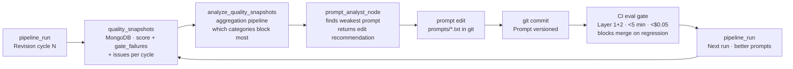

<div align="center">

# Medium Agent Factory

[](https://github.com/GatoProgramador-01/medium-agent-factory/actions/workflows/ci.yml)
[](https://github.com/GatoProgramador-01/medium-agent-factory/actions/workflows/eval.yml)
[](https://www.python.org/)
[](https://www.typescriptlang.org/)
[](https://nextjs.org/)
[](https://www.mongodb.com/atlas)
[](https://langchain.com/)
[](#test-suite)
[](LICENSE)

**21-node LangGraph pipeline that writes, evaluates, and revises Medium posts with G-Eval quality gates and eval-in-CI.**

[Live Demo](https://medium-agent-factory.vercel.app) &nbsp;|&nbsp; Backend hosted on Railway &nbsp;|&nbsp; [View Source](https://github.com/GatoProgramador-01/medium-agent-factory)

</div>

---

## The Problem

Every developer who has tried to automate technical blog writing runs into the same wall. The draft looks fine. The grammar is clean. But read it back — really read it — and you notice: the statistics are suspiciously round, the numbers have no sources, sentences begin with "Moreover" and "Furthermore," and the hook announces the topic instead of opening mid-action. The word count is 1,062, not the 1,300 the Medium Partner Program requires. You could fix it by hand, but that defeats the purpose. You could prompt the model to "make it better," but that produces more of the same — AI writing about AI, in the style of AI, citing AI-generated figures that may or may not exist.

The real question is: can a pipeline of specialized agents, each holding the others accountable, produce content that passes a human curator's review?

This project is the answer.

---

## Live Demo

[Live Demo](https://medium-agent-factory.vercel.app) — frontend on Vercel, backend FastAPI on Railway, database on MongoDB Atlas (free M0).

> Note: the live instance uses the free tier. Cold starts on the Railway backend may take 10–15 seconds on first request.

---

## How It Works — The Story Arc

### Act 1 — A Pipeline Is Born

The first version was three nodes in a LangGraph graph: **Write → Quality → Revise**. A writer agent drafted a post, a quality agent scored it, and a reviser fixed it. If the score crossed a threshold, a formatter cleaned it and saved it to MongoDB. Simple — but the quality gate was a black box of penalty weights with magic numbers like `0.12` for HIGH and `0.05` for MEDIUM. The reviser had no idea why it was failing. It just knew the score was 0.63 and tried again.

### Act 2 — Quality as Code

The second act turned intuition into deterministic rules. The key insight: quality checks split cleanly into two worlds. Structural metrics — sentence length, heading gaps, word count, forbidden phrases — are pure computation. Content quality needs a language model, but it needs a rubric, not magic weights. That rubric is G-Eval (EMNLP 2023): the LLM scores four axes independently on a 0.0–1.0 scale. No more black box. Every gate lives in config. Every revision gets a structured reason, not just a score.

### Act 3 — The Series Machine

A single well-written post is fine. A three-post series that reads like chapters of the same guide — each opening from a different angle, never repeating what the previous one covered — is what earns readers who follow the author. The series planner drafts an outline. Each run injects `series_context`: what was covered, what not to repeat, what to build on. The result is continuity, not repetition.

**Validation run — DeepSeek cost savings series (June 2026):**

| Post | Words | Content Score | Boost Eligible | Revisions |
|------|-------|---------------|----------------|-----------|
| 1 | 1,356 | 1.00 | yes | 2 |
| 2 | 1,302 | 1.00 | yes | 6 |
| 3 | 1,363 | 1.00 | yes | 2 |

---

## Sample Output — Recent Posts

Posts generated by the pipeline, scored by G-Eval, and flagged Boost-eligible by the publication matcher.

| Title | Score | Words | Boost |
|-------|-------|-------|-------|
| The 40 API Calls That Cost Me $1,200 a Month on AWS | 1.00 | 1,503 | yes |
| Lost $300 in 4 Hours to Empty 200s — Built Control Plane | 1.00 | 1,442 | yes |
| FastAPI hit 170k RPS when I fixed this Redis caching mistake | 0.95 | 1,349 | yes |
| I Fixed AI Coding Chaos With an OS for Claude Code | 0.90 | 1,585 | yes |

---

## Architecture

### Full Pipeline — 21 Nodes

```mermaid
flowchart TD
    api[FastAPI · POST /pipeline/runs]
    api --> repo_analysis[repo_analysis_node\nRepoAnalyzer · EvidenceBrief\noptional · skips when repo_path=None]
    repo_analysis --> topic_refiner[topic_refiner_node\nTopicBrief · angle + hook seed]
    topic_refiner --> research[research_node\nWebResearcher · Tavily · trend_context]
    research --> exemplar[exemplar_store_node\nMongoDB few-shot retrieval]
    exemplar --> content_gen[content_generation_node\nContentGenerator · Claude Haiku · initial draft]

    content_gen --> fact_check[fact_checker_node\nClaude Haiku · claim extraction\n+ parallel Tavily verification]
    fact_check -->|SUPPORTED → hyperlink| annotate[Annotate Draft]
    fact_check -->|UNVERIFIABLE → QualityIssue| issues[Issue List]

    annotate & issues --> ai_slop[ai_slop_check\nforbidden phrase scanner\nblocks on HIGH severity]
    ai_slop --> truth_enf[truth_enforcement\nclaim-source alignment\nblocks unverifiable assertions]
    truth_enf --> human_voice[human_voice_check\ncontractions · anecdote · hedging\nblocks AI-generic register]

    human_voice --> line_edit[line_edit_check\npassive voice · long sentences\nsentence variety score]
    line_edit --> structure[structure_check\nH2/H3 heading count\nparagraph length · conclusion signals]
    structure --> copy_edit[copy_edit_check\nheading consistency · exclamation rate\nem-dash spacing · repeated words]

    copy_edit --> structural[structural_checker_node\nLayer A · Python · zero LLM cost\nparagraph_length · heading_cadence\nword_count · ai_pattern]
    copy_edit --> llm_quality[quality_analysis_node\nLayer B · G-Eval Rubric\nClaude Haiku · 4 axes · 0.0–1.0]

    structural --> merge[Merge Issues]
    llm_quality --> merge

    merge --> gate{All 4 gates\npass?}
    gate -->|yes| title_opt[title_optimizer_node\nClaude Haiku · candidate titles]
    gate -->|no + cycles left| reviser[reviser · Claude Haiku / Sonnet]
    reviser --> content_gen

    title_opt --> intro_ab[intro_ab_tester_node\nA/B intro variants · best hook selected]
    intro_ab --> close_opt[close_optimizer_node\nCTA + closing paragraph]
    close_opt --> img_enrich[image_description_enricher_node\nalt-text + caption injection]
    img_enrich --> pub_match[publication_matcher_node\nTop-3 publications · confidence score]

    pub_match --> coherence{series run?}
    coherence -->|yes| series_check[series_coherence_checker_node\nnon-repetition · continuity score]
    coherence -->|no| formatter_node[formatter_node\nClaude Haiku · pull quote + final clean]
    series_check --> formatter_node

    formatter_node --> post_proc[post_processor_node\ncaption injection · source merge]
    post_proc --> mongo[(MongoDB\nposts + quality_snapshots)]
    post_proc --> sse[SSE Stream → Frontend]
```



### Quality Feedback Loop



### Modular Node-Agent Architecture

The LangGraph pipeline is strictly modularized to separate orchestration state transitions from core agent intelligence. This is achieved through a two-layer design:

1.  **Node Coordination Layer (`backend/app/agents/nodes/`)**:
    *   Acts as the LangGraph state machine boundary. Each node (e.g., [fact_check_node](file:///C:/Users/lanitaEmperadora/medium-agent-factory/backend/app/agents/nodes/fact_check.py) or [quality_analysis_node](file:///C:/Users/lanitaEmperadora/medium-agent-factory/backend/app/agents/nodes/quality_analysis.py)) is a clean Python function wrapping logic, state updates, and logs.
    *   **Dynamic Import Pattern**: To enable complete unit test isolation and global mock patching, all node functions dynamically import their corresponding core agent helpers inside the function body (e.g., importing `verify_claims` within the execution of the node function). This ensures test runners can patch helper modules *after* importing the node modules, avoiding rigid module-level bindings.

2.  **Core Agent Tool Layer (`backend/app/agents/`)**:
    *   Houses the functional execution engines, prompt loaders, and LLM interfaces (e.g., [fact_checker.py](file:///C:/Users/lanitaEmperadora/medium-agent-factory/backend/app/agents/fact_checker.py), [quality_analyzer.py](file:///C:/Users/lanitaEmperadora/medium-agent-factory/backend/app/agents/quality_analyzer.py)).
    *   Contains pure, stateless business logic that operates independently of LangGraph's routing state, simplifying unit testing and prompt isolation.

---


## Quality Gates

All four must pass before the post is finalized. Any failure routes to the reviser for another cycle. Maximum cycles: 6.

| Gate | Config Key | Threshold | What It Blocks |
|------|-----------|-----------|----------------|
| Gate 1 · Content quality | `min_quality_score` | `0.70` | Weak hook, generic voice, no insight |
| Gate 2 · Read ratio | `min_read_ratio` | `0.65` | Predicted 30-second read rate below "Strong" |
| Gate 3 · AI patterns | `block_high_ai_patterns` | `true` | Any HIGH-severity forbidden phrase |
| Gate 4 · Word count | `min_word_count` | `1300` | Below Medium Partner Program minimum |

---

## G-Eval Axes

`content_score = mean(hook_strength, specificity, voice_authenticity, insight_value)`

Each axis is scored 0.0–1.0 by Claude Haiku independently. No weighting. No black box.

| Axis | 1.0 Description | 0.0 Description |
|------|----------------|----------------|
| `hook_strength` | Specific outcome (number, dollar amount, failure) in sentence 1 before word 15 | No hook at all; opens with a topic announcement |
| `specificity` | 3+ named data points — company names, dates, amounts with source | Fully abstract; zero concrete anchors |
| `voice_authenticity` | Contractions throughout, personal anecdote with named detail, no AI hedging | Multiple forbidden phrases; zero personal voice |
| `insight_value` | Non-obvious claim + concession + specific prediction | Zero original insight; could have been written by anyone |

### Quality Intelligence — Editorial Nodes

| Node | Checks | Severity | Gate Key |
|------|--------|----------|----------|
| Line Editor | Passive voice, sentence length, variety | MEDIUM | line_edit_check |
| Structure Validator | Heading count, paragraph length, conclusion | MEDIUM | structure_check |
| Copy Editor | Heading consistency, exclamation rate, repeated words | LOW | copy_edit_check |

---

## LLMOps

### 3-Layer Eval Architecture

Every change to an agent or prompt triggers an eval run in CI before the PR can merge.

| Layer | Cost | Model | Trigger | Gate |
|-------|------|-------|---------|------|
| Layer 1 — Score direction | ~$0.002/case | Claude Haiku | Every PR | Block on fail (accuracy >= 75%) |
| Layer 2 — Batch regression | ~$0.04 total | Claude Haiku | Every PR | Catches calibration drift |
| Layer 3 — LLM-as-judge | ~$0.005/case | Claude Sonnet | Nightly only (`eval_deep` marker) | Advisory |

Layer 1 and 2 run under 5 minutes and under $0.05. Layer 3 runs nightly. The eval workflow triggers on path filters: `backend/app/agents/**`, `backend/prompts/**`, `backend/evals/**`.

### Prompt Versioning

Prompts are code. Every prompt lives in `prompts/` as a `.txt` file, versioned in git, loaded at startup into a module-level cache. No prompt strings inside agent files. 27 prompt files across 14 agents.

```python
# app/prompt_loader.py
_CACHE: dict[str, str] = {
    p.stem: p.read_text(encoding="utf-8")
    for p in (Path(__file__).parent.parent / "prompts").glob("*.txt")
}
```

Changing a prompt without a test is a CI failure. The eval gate catches regression before it reaches production.

### LangSmith Tracing

All pipeline runs emit traces to LangSmith. Each trace is tagged with `run_id`, `series_id`, `revision_cycle`, and `environment`. Quality scores, gate decisions, and revision reasons are logged as structured metadata — not buried in unstructured text.

### Quality Snapshot Analytics

Every quality check — pass or fail, on every revision cycle — writes a document to MongoDB's `quality_snapshots` collection. This accumulates a dataset of which issue categories persist across cycles and which revision prompts are most effective.

```json
{
  "run_id": "abc-123",
  "iteration": 2,
  "score": 0.74,
  "passed": false,
  "gate_failures": ["word_count"],
  "issue_summary": { "high": 0, "medium": 1, "low": 1, "total": 2 },
  "issues": [
    { "severity": "LOW", "category": "word_count", "location": "full post", "suggestion": "..." }
  ],
  "topic": "DeepSeek cost savings",
  "series_id": "ce30bf36"
}
```

Query to find which issue categories block posts most often:

```javascript
db.quality_snapshots.aggregate([
  { $unwind: "$issues" },
  { $group: { _id: "$issues.category", count: { $sum: 1 } } },
  { $sort: { count: -1 } }
])
```

---

## Tech Stack

| Layer | Technology |
|-------|-----------|
| Orchestration | LangGraph (StateGraph + conditional edges) |
| LLM — supervisor | Claude Sonnet 4.6 |
| LLM — workers | Claude Haiku 4.5 |
| LLM — optional | DeepSeek V3, Ollama (local) |
| Web research + fact-checking | Tavily Search API |
| Storage | MongoDB Atlas (Motor async driver) |
| API | FastAPI + Server-Sent Events (SSE) |
| Frontend | Next.js 15 + Tailwind CSS |
| Prompts | 27 git-versioned `.txt` files |
| Config | Pydantic Settings (environment variables) |
| Observability | LangSmith tracing |
| CI/CD | GitHub Actions (5 jobs) |
| Deploy | Railway (backend) + Vercel (frontend) |
| IaC option | Terraform (AWS ECS Fargate) |
| Containerization | Docker + GitHub Container Registry |

---

## Test Suite

**562 tests — TDD throughout (Red → Green → Refactor).**

Every feature started with a failing test. No `// TODO: add tests` is committed. The CI pipeline blocks merges if tests fail or coverage drops. The eval gate runs on every PR touching agents or prompts.

```
backend/tests/
├── test_fact_checker.py              # claim extraction, parallel verification, hyperlink injection
├── test_structural_checker.py        # 19 tests · paragraph, heading, intro, word count, ai_pattern
├── test_quality_snapshot.py          # MongoDB snapshot persistence + structural integration
├── test_routing.py                   # route_after_quality — pure logic, zero LLM calls
├── test_prompt_refinements.py        # G-Eval rubric axis presence, category canonicalization
├── test_validators.py                # Pydantic unicode-normalizer coerce fix
├── test_formatter.py                 # pull quote extraction, formatting rules
├── test_series_context.py            # series planner output, continuity injection
├── test_llm_factory.py               # get_llm() routing (Anthropic / DeepSeek / Ollama)
├── test_prompt_loader.py             # prompt file loading and caching
├── test_topic_refiner.py             # TopicBrief structured output + EvidenceBrief injection
├── test_repo_analyzer.py             # EvidenceBrief extraction, hallucination guards
├── test_intro_ab_tester.py           # A/B variant scoring, best hook selection
├── test_close_optimizer.py           # CTA generation, closing paragraph structure
├── test_series_coherence_checker.py  # non-repetition detection, continuity scoring
├── test_title_optimizer.py           # candidate title variants, click-through heuristics
├── test_publication_matcher.py       # publication confidence scores, top-3 ranking
├── test_image_description_enricher.py # alt-text injection, caption formatting
├── test_post_processor.py            # caption merge, source section deduplication
└── e2e/
    └── test_api.py                   # real FastAPI + real MongoDB (pytest-asyncio)

frontend/src/
└── **/*.test.tsx                     # Jest + React Testing Library · QualityPanel,
                                      # SourcesPanel, RevisionHistoryPanel, SeriesNav,
                                      # SSE stream integration
```

### Unified Python CI Script

To simplify running local validation, we provide a unified Python CI script in [scripts/run_ci.py](file:///C:/Users/lanitaEmperadora/medium-agent-factory/backend/scripts/run_ci.py) inside the `backend` folder. This script automates linting, typing, and testing checks in one command.

To run the CI script:
*   **Windows (PowerShell/Command Prompt)**:
    ```powershell
    .venv/Scripts/python.exe scripts/run_ci.py
    ```
*   **macOS / Linux**:
    ```bash
    .venv/bin/python scripts/run_ci.py
    ```

The script executes the following checks sequentially:
1.  **Ruff Linter**: Runs formatting and style audits (`ruff check app`).
2.  **Mypy Static Type Analyzer**: Enforces strict Python typing (`mypy app`).
3.  **Pytest Unit Tests**: Runs the backend test suite (`pytest`).

---


## Quick Start

### Docker (recommended)

```bash
cp backend/.env.example backend/.env
# Edit backend/.env — set ANTHROPIC_API_KEY, TAVILY_API_KEY, MONGODB_URI

docker compose up --build
# Frontend: http://localhost:3000
# Backend:  http://localhost:8000/docs
```

### Manual — Backend

```bash
cd backend
python -m venv .venv

# Windows (Git Bash)
source .venv/Scripts/activate
# macOS / Linux
source .venv/bin/activate

pip install -e ".[dev]"
cp .env.example .env
# Edit .env — set ANTHROPIC_API_KEY, TAVILY_API_KEY, MONGODB_URI

# Start server (Windows PowerShell)
Start-Process -FilePath ".\.venv\Scripts\python.exe" `
  -ArgumentList "-m", "uvicorn", "app.main:app", "--port", "8000", "--reload" -NoNewWindow

pytest tests/ -v
```

### Manual — Frontend

```bash
cd frontend
npm install
cp .env.local.example .env.local
# Set NEXT_PUBLIC_API_URL=http://localhost:8000
npm run dev
```

### Generate a post

```bash
# Single post
curl -X POST http://localhost:8000/pipeline/runs \
  -H "Content-Type: application/json" \
  -d '{"custom_topic": "Why DeepSeek V3 cut our inference costs by 73% — with real numbers from 30 days of production logs"}'

# Watch the SSE stream
curl http://localhost:8000/pipeline/runs/{run_id}/stream

# Single post grounded in a local repo
curl -X POST http://localhost:8000/pipeline/runs \
  -H "Content-Type: application/json" \
  -d '{"custom_topic": "How I scraped 43k judiciary PDFs without a browser", "repo_path": "/path/to/pj-peru-scraper"}'

# Generate a 3-post series
curl -X POST http://localhost:8000/series \
  -H "Content-Type: application/json" \
  -d '{"topic": "LLM cost optimization guide for agent developers", "num_posts": 3}'
```

---

## Alternative LLM Backends

The entire pipeline routes through [get_llm](file:///C:/Users/lanitaEmperadora/medium-agent-factory/backend/app/agents/llm_factory.py#L47) in [llm_factory.py](file:///C:/Users/lanitaEmperadora/medium-agent-factory/backend/app/agents/llm_factory.py). Switching backends requires environment variables — no changes inside agent files.

### Local LLM via Ollama
```bash
# Local inference via Ollama (zero API cost)
USE_LOCAL_LLM=true LOCAL_LLM_MODEL=llama3.2 uvicorn app.main:app --port 8000
```
Inside Docker, set `LOCAL_LLM_BASE_URL=http://ollama:11434`. Outside Docker, it defaults to `http://localhost:11434`.

### DeepSeek Cloud Inference
To route model requests to DeepSeek's cloud API, configure the backend using:
```bash
USE_DEEPSEEK=true
DEEPSEEK_API_KEY=sk-...
DEEPSEEK_MODEL=deepseek-v4-flash
```

#### Automatic Fallback Guardrail
When the fact-checking node [fact_check_node](file:///C:/Users/lanitaEmperadora/medium-agent-factory/backend/app/agents/nodes/fact_check.py) flags assertions that cannot be validated via parallel Tavily searches, the pipeline applies an **automatic fallback guardrail** inside the finalizer node [finalize_node](file:///C:/Users/lanitaEmperadora/medium-agent-factory/backend/app/agents/nodes/finalize.py). If a post contains unverifiable claims (marked as `HIGH` severity), the finalizer dynamically detects this and sets `recommended_publication` to `False` and `publication_confidence` to `0.0`. This ensures unverified output is explicitly marked as unfit for publication.

---

## Environment Variables

| Variable | Default | Description |
|----------|---------|-------------|
| `ANTHROPIC_API_KEY` | — | Required unless `USE_LOCAL_LLM=true` or `USE_DEEPSEEK=true` |
| `TAVILY_API_KEY` | — | Web research and fact-checking. Skips gracefully when absent. |
| `MONGODB_URI` | `mongodb://localhost:27017` | MongoDB connection string |
| `MONGODB_DATABASE` | `medium_agent_factory` | Database name (use `_test` suffix in tests) |
| `MIN_QUALITY_SCORE` | `0.70` | G-Eval content score gate |
| `MIN_READ_RATIO` | `0.65` | Predicted 30-second read rate gate |
| `MIN_WORD_COUNT` | `1300` | Partner Program word count minimum |
| `MAX_REVISION_CYCLES` | `6` | Maximum revision attempts before forced finalize |
| `BLOCK_HIGH_AI_PATTERNS` | `true` | Block posts with HIGH-severity AI pattern phrases |
| `FACT_CHECK_ENABLED` | `true` | Run claim extraction and Tavily verification |
| `USE_LOCAL_LLM` | `false` | Route all LLM calls to Ollama |
| `USE_DEEPSEEK` | `false` | Route all LLM calls to DeepSeek V3/V4 |
| `DEEPSEEK_API_KEY` | — | DeepSeek API key for cloud inference |
| `DEEPSEEK_MODEL` | `deepseek-chat` | DeepSeek model name (e.g. `deepseek-v4-flash` or `deepseek-chat`) |
| `LOCAL_LLM_MODEL` | `llama3.2` | Ollama model name |
| `LOCAL_LLM_BASE_URL` | `http://localhost:11434` | Ollama server URL |
| `LANGCHAIN_TRACING_V2` | `false` | Enable LangSmith tracing |
| `LANGCHAIN_PROJECT` | `medium-agent-factory` | LangSmith project name |

---

## Skills Demonstrated

| Skill | Evidence |
|-------|---------|
| LangGraph stateful multi-agent orchestration — 21 nodes, conditional edges, revision loop | `backend/app/agents/orchestrator.py` |
| G-Eval LLM-as-judge evaluation (EMNLP 2023) — 4 independent axes, 0.0–1.0 rubric, no weighting | `backend/app/agents/quality_analyzer.py` |
| 3-layer quality architecture: deterministic + LLM rubric + config gates | `backend/app/agents/structural_checker.py`, `quality_analyzer.py`, `config.py` |
| Parallel async fact-checking — claim extraction + Tavily verification + hyperlink injection | `backend/app/agents/fact_checker.py` |
| Repo grounding — EvidenceBrief extraction from local/GitHub repos, hallucination prevention | `backend/app/agents/repo_analyzer.py` |
| A/B intro testing — multiple hook variants scored and ranked before committing to one | `backend/app/agents/intro_ab_tester.py` |
| Series coherence checking — non-repetition detection across posts in a series | `backend/app/agents/series_coherence_checker.py` |
| SSE streaming — FastAPI event generator to Next.js EventSource, no polling, no websocket | `backend/app/routers/pipeline.py` |
| LLMOps: eval-in-CI, 3-layer eval architecture, LangSmith tracing, 27 versioned prompt files | `backend/evals/`, `backend/prompts/`, `.github/workflows/eval.yml` |
| Multi-model cost switching — Anthropic / DeepSeek / Ollama via single factory function | `backend/app/agents/llm_factory.py` |
| MongoDB quality analytics — `quality_snapshots` collection + aggregation pipeline | `backend/app/routers/analytics.py` |
| TDD throughout — 562 tests, Red → Green → Refactor, no retrofitted tests | `backend/tests/`, `frontend/src/**/*.test.tsx` |
| Docker + GitHub Actions 5-job CI/CD pipeline + Railway/Vercel deploy | `.github/workflows/`, `docker-compose.yml` |
| Pydantic unicode-normalizer coerce fix — every str→list validator handles curly quotes / em-dashes | `backend/app/models/post.py` |

---

## Project Structure

```
medium-agent-factory/
├── backend/
│   ├── app/
│   │   ├── agents/
│   │   │   ├── orchestrator.py                ← LangGraph pipeline — 21 nodes + conditional edges
│   │   │   ├── content_generator.py           ← writer agent (Claude Haiku)
│   │   │   ├── quality_analyzer.py            ← G-Eval rubric (Layer B)
│   │   │   ├── structural_checker.py          ← deterministic checks (Layer A)
│   │   │   ├── fact_checker.py                ← claim extraction + Tavily verification
│   │   │   ├── topic_refiner.py               ← TopicBrief · angle + hook seed
│   │   │   ├── repo_analyzer.py               ← EvidenceBrief from local/GitHub repos
│   │   │   ├── intro_ab_tester.py             ← A/B intro variants + scoring
│   │   │   ├── close_optimizer.py             ← CTA + closing paragraph
│   │   │   ├── series_coherence_checker.py    ← non-repetition + continuity scoring
│   │   │   ├── title_optimizer.py             ← candidate title generation
│   │   │   ├── publication_matcher.py         ← top-3 publication fit + confidence
│   │   │   ├── image_description_enricher.py  ← alt-text + caption injection
│   │   │   ├── post_processor.py              ← caption merge + source section dedup
│   │   │   ├── series_planner.py              ← series outline + hook seeds
│   │   │   ├── web_researcher.py              ← Tavily trend research
│   │   │   ├── read_ratio_analyzer.py         ← predicted 30-sec read rate
│   │   │   ├── exemplar_store.py              ← few-shot exemplar retrieval
│   │   │   ├── prompt_analyst.py              ← prompt weakness detection
│   │   │   └── llm_factory.py                 ← get_llm(role) — single model config point
│   │   ├── models/post.py                     ← QualityReport, QualityIssue, AtomicClaim, EvidenceBrief
│   │   ├── routers/
│   │   │   ├── pipeline.py                    ← POST /pipeline/runs + SSE /stream
│   │   │   ├── posts.py                       ← GET /posts
│   │   │   ├── series.py                      ← POST /series
│   │   │   └── analytics.py                   ← quality_snapshots aggregations
│   │   ├── config.py                          ← Pydantic Settings
│   │   ├── database.py                        ← Motor async client singleton
│   │   └── prompt_loader.py                   ← startup cache for 27 git-versioned prompts
│   ├── prompts/                               ← 27 .txt prompt files, one per agent role
│   ├── evals/                                 ← 3-layer eval suite (JSONL datasets)
│   └── tests/                                 ← 562 tests, TDD
├── frontend/
│   └── src/
│       ├── components/
│       │   ├── QualityPanel.tsx               ← G-Eval scores + gate pass/fail
│       │   ├── SourcesPanel.tsx               ← verified claim hyperlinks
│       │   ├── RevisionHistoryPanel.tsx        ← per-cycle quality snapshots
│       │   └── SeriesNav.tsx                  ← series navigation
│       └── app/                               ← Next.js 15 App Router pages
├── infra/                                     ← Terraform (AWS ECS Fargate option)
│   ├── modules/
│   └── envs/dev/
├── docker-compose.yml
└── .github/
    └── workflows/
        ├── ci.yml                             ← 5-job pipeline
        ├── eval.yml                           ← eval gate (path-filtered)
        └── deploy.yml                         ← Railway + Vercel on merge
```

---

<details>
<summary>Sprint History (Sprints 1 – 29)</summary>

<details>
<summary>Sprint 29 — Copy Editor node + passive voice improvements (2026-06-30)</summary>

- `copy_editor_node` — heading consistency, exclamation rate, em-dash spacing, repeated words
- `line_editor_node` improved: 33 irregular VBN past participles, abbreviation-safe sentence splitter (Dr./Mr./U.S.), variety bonus suppressed when long-sentence ratio >= 50%
- `structure_validator_node` improved: 18 conclusion signals, H2/H3 only (H1 excluded), cap raised to 5 headings
- Pipeline now 21 nodes: `... -> line_edit_check -> structure_check -> copy_edit_check -> quality_analysis`
- 562 unit tests passing

</details>

<details>
<summary>Sprint 28 — Line Editor + Structure Validator nodes + expert prompt mandates (2026-06-30)</summary>

- `line_editor_node` — passive voice ratio, long-sentence ratio (>30 words), sentence variety score
- `structure_validator_node` — H2/H3 heading count, paragraph length, list detection, conclusion signals
- CRLF-safe paragraph splitting: `\r?\n[ \t]*\r?\n`
- Conclusion tail = `max(400, len/5)` chars (position-aware, not fixed slice)
- `content_generator_system.txt`: Developmental Editor + Line Editor + Readability mandates appended
- `content_reviser_system.txt`: expert editorial revision checklist appended
- 544 unit tests passing (was 517)

</details>

<details>
<summary>Sprint 27 — Gate blockers fixed + unattributed number gate (2026-06-30)</summary>

- `strip_code_blocks`: single-pass regex, handles backticks inside fenced blocks
- `human_voice_scorer`: prose-only analysis (strips code before metrics), explicit False on zero prose
- `truth_enforcer_node`: returns `truth_enforcer_passed=True` on empty content (key always present)
- `quality_analysis`: `block_unattributed_numbers` gate wired, monitoring logs for all node failures
- 517 unit tests passing (was 437)

</details>

| Sprint | What Shipped |
|--------|-------------|
| 1 | Core LangGraph pipeline: Write → Quality → Revise → Format; MemorySaver state, first SSE stream |
| 2 | Penalty weight quality scoring system (v1 — magic numbers `0.12`/`0.05`; replaced in Sprint 5) |
| 3 | Series planner, `series_context` injection, multi-post continuity; 3-post run validated |
| 4 | Read ratio analyzer — predicted 30-second read rate added as Gate 2 |
| 5 | Quality redesign: Layer A (structural checker) + Layer B (G-Eval rubric 4 axes) + Layer C (config gates); penalty weights retired |
| 6 | `min_word_count` raised 1000 → 1300; DeepSeek cost savings series validated (all 3 posts Boost-eligible, scores 0.96/0.97/1.00) |
| 7 | Fact checker agent: claim extraction + parallel Tavily verification + hyperlink injection |
| 8 | SSE streaming: FastAPI event generator → Next.js `EventSource` with `__done__` sentinel |
| 9 | Frontend dashboard: QualityPanel, SourcesPanel, RevisionHistoryPanel, SeriesNav components |
| 10 | LLMOps: 3-layer eval architecture, eval-in-CI (path-filtered), LangSmith tracing, prompt versioning |
| 11 | `max_revision_cycles` raised 2 → 6; `quality_snapshots` MongoDB collection; analytics router + aggregation queries |
| 12 | Multi-model cost switching (DeepSeek V3 / Ollama); Docker + GitHub Container Registry; Railway + Vercel deploy |
| 13 | `topic_refiner` node: TopicBrief structured output, angle + hook seed injected into content generation |
| 14 | `title_optimizer` node: multiple candidate titles, click-through heuristics, A/B scoring |
| 15 | `intro_ab_tester` node: 3 opening variants generated and scored; best hook committed to state |
| 16 | `close_optimizer` node: CTA generation + closing paragraph structure enforced |
| 17 | `publication_matcher` node: top-3 publications ranked by fit, confidence score stored |
| 18 | `image_description_enricher` + `post_processor` nodes: alt-text injection, caption merge, source section deduplication; `series_coherence_checker` added for series runs |
| 19 | `repo_analyzer` node wired: EvidenceBrief extracted from local/GitHub repos; `grounding_context` + `evidence_brief` added to PipelineState; hallucination guards; 453 tests |
| 20 | Quality snapshot analytics dashboard wired to frontend; prompt analyst node identifies weakest prompts; full pipeline reaches 16 nodes |
| 21 | Fixed `unattributed_claim` issue (0 per run); BENCHMARK CLAIM RULE added to `content_generator_system.txt`; 15 test fixes; 463 tests |
| 25 | Quality gate wiring: ai_slop, truth_enforcer, human_voice gates now block publication; replace-not-accumulate pattern; code fence stripping; 583 tests |

</details>

---

## License

MIT — see [LICENSE](LICENSE).

Contributing: open an issue or PR. The pipeline is modular — adding a new node means a new file in `agents/`, a failing test, a passing test, and a prompt in `prompts/`. The orchestrator wiring is the last step.
