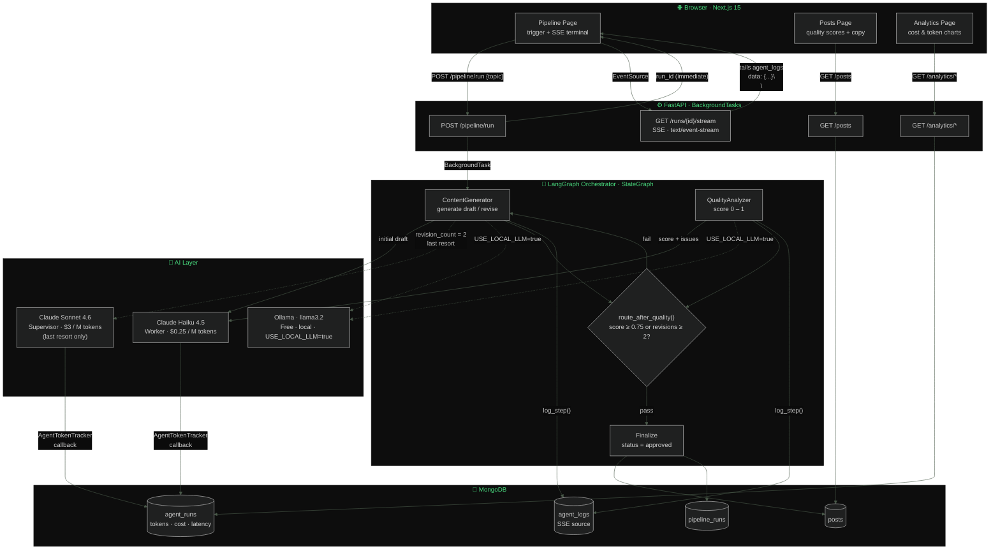
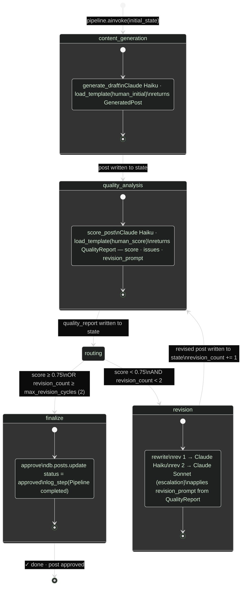
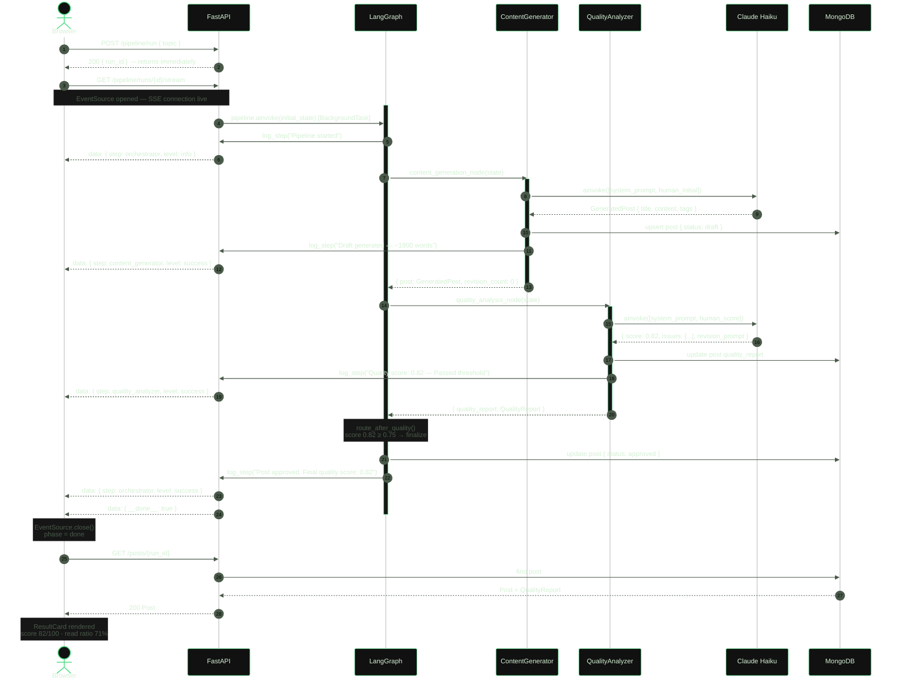
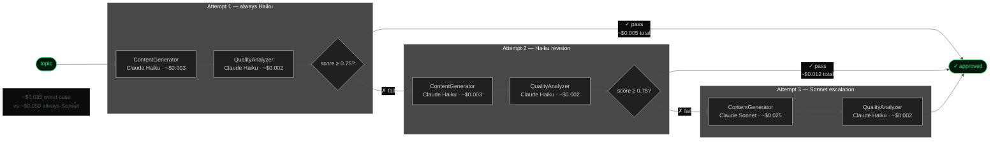
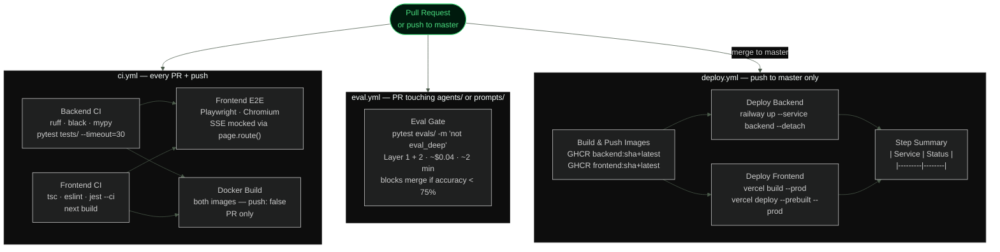

# medium-agent-factory

[](https://github.com/GatoProgramador-01/medium-agent-factory/actions/workflows/ci.yml)
[](https://github.com/GatoProgramador-01/medium-agent-factory/actions/workflows/eval.yml)
[](https://www.python.org/)
[](https://nodejs.org/)
[](LICENSE)

A production-grade LLM content pipeline built on **LangGraph** + **FastAPI** + **Next.js**. Give it a topic — it writes, scores, and revises a full article using a multi-agent loop, streaming every decision live to the browser.

> **The meta story:** the posts in `/posts` were written by this pipeline about this pipeline. All three scored 0.82 on the first attempt with zero revisions.

---

## System Architecture



---

## LangGraph Pipeline — State Machine



---

## Request Lifecycle — One Pipeline Run



---

## Cost Model

The pipeline uses the cheapest model that can do the job and escalates only when needed.



---

## CI/CD Pipeline



---

## LLMOps Patterns

Each pattern was built, broken, debugged, and verified with tests before moving on.

| Week | Pattern | Production problem it solves |
|---|---|---|
| 1 | **3-layer eval pipeline** | Prompt regressions reach production silently — eval gate blocks them before merge |
| 2 | **Ollama local switch** | API bills during development — `USE_LOCAL_LLM=true` routes everything to a free local model |
| 2 | **SSE streaming** | Polling creates 2× DB round trips per second — SSE uses one persistent connection |
| 3 | **Prompt versioning** | Prompts buried in code can't be reviewed or rolled back — `.txt` files in git with eval gate trigger |
| 4 | **LangChain retry + tenacity** | Anthropic 529 overloaded errors fail silently — automatic backoff with jitter |

---

## Stack

| Layer | Technology |
|---|---|
| Orchestration | LangGraph (StateGraph with revision loop) |
| LLM — worker | Claude Haiku 4.5 ($0.25/M tokens) |
| LLM — supervisor | Claude Sonnet 4.6 ($3/M tokens, last resort only) |
| Local LLM | Ollama (`USE_LOCAL_LLM=true` — zero cost, drop-in swap) |
| Agent framework | LangChain · `.with_structured_output(PydanticModel)` |
| Observability | LangSmith tracing · per-agent token + cost tracking |
| Backend | FastAPI · Motor (async MongoDB) |
| Frontend | Next.js 15 · React 19 · TypeScript · Tailwind CSS · Recharts |
| Tests | pytest (31 unit) · Jest + RTL (15 unit) · Playwright (9 E2E) |
| CI/CD | GitHub Actions · Railway · Vercel · GHCR |
| Database | MongoDB 7 (Docker local) · MongoDB Atlas M0 (production) |

---

## Quick Start

### Prerequisites

- Python 3.11+ and Node.js 22+
- Docker (for local MongoDB) or MongoDB on port 27017
- [Anthropic API key](https://console.anthropic.com)

### 1. Clone and configure

```bash
git clone https://github.com/GatoProgramador-01/medium-agent-factory
cd medium-agent-factory
cp .env.example .env
# Edit .env — add ANTHROPIC_API_KEY at minimum
```

### 2. Start MongoDB

```bash
docker run -d -p 27017:27017 --name mongo mongo:7
```

### 3. Backend

```bash
cd backend
python -m venv .venv && .venv/Scripts/activate   # Windows
# source .venv/bin/activate                      # macOS / Linux
pip install -e ".[dev]"
uvicorn app.main:app --reload
# → http://localhost:8000/docs
```

### 4. Frontend

```bash
cd frontend
npm install && npm run dev
# → http://localhost:3000
```

### 5. Run the pipeline

Open `http://localhost:3000/pipeline`, type a topic, press Enter.

```bash
# Or via curl
curl -X POST http://localhost:8000/pipeline/run \
  -H "Content-Type: application/json" \
  -d '{"custom_topic": "how I cut LLM costs 10x with Ollama"}'
```

---

## Docker Compose

```bash
# Full stack — backend + frontend (MongoDB must be running)
docker compose up

# With Ollama — zero Anthropic API cost
docker compose --profile local-llm up
docker compose exec ollama ollama pull llama3.2
# Set USE_LOCAL_LLM=true in .env and restart backend
```

---

## Development

### Backend

```bash
cd backend

black .                                   # format
ruff check .                              # lint
mypy app/                                 # type check (strict)
pytest tests/ -v --timeout=30            # unit tests (31 tests, no LLM calls)
pytest evals/ -v -m "not eval_deep"      # eval gate — Layer 1 + 2
pytest evals/ -v -m eval_deep            # nightly LLM-as-judge
python -m evals.langsmith_eval "v1"      # visual diff in LangSmith
```

### Frontend

```bash
cd frontend

npx tsc --noEmit                          # type check
npm run lint                              # ESLint
npm run test:unit                         # Jest + RTL (15 tests, mocked API)
npm run test:e2e                          # Playwright — requires built app running
npm run build                             # production build (catches runtime errors)
```

---

## Eval Pipeline

Quality regressions are caught in CI before they merge.

| Layer | What it checks | Cost | When |
|---|---|---|---|
| Score direction | Good posts ≥ 0.70, bad posts ≤ 0.55 per case | ~$0.002/case | Every PR |
| Cohort mean | Score distribution doesn't drift from baseline | ~$0.04 total | Every PR |
| LLM-as-judge | Revision prompts are specific and actionable | ~$0.005/case | Nightly only |

The CI path filter only triggers eval when these paths change:

```
backend/app/agents/**    backend/prompts/**
backend/evals/**         backend/pyproject.toml
```

---

## Deployment

Production stack: **Railway** (backend Docker) + **Vercel** (Next.js) + **MongoDB Atlas** (free M0).

### Required GitHub secrets

| Secret | Source |
|---|---|
| `ANTHROPIC_API_KEY` | console.anthropic.com |
| `LANGCHAIN_API_KEY` | smith.langchain.com |
| `RAILWAY_TOKEN` | railway.app → Account Settings → Tokens |
| `VERCEL_TOKEN` | vercel.com → Account Settings → Tokens |

### Required GitHub variables

| Variable | Value |
|---|---|
| `NEXT_PUBLIC_API_URL` | Your Railway service URL |
| `BACKEND_URL` | Your Railway service URL |
| `FRONTEND_URL` | Your Vercel project URL |
| `VERCEL_ORG_ID` | Vercel → Account Settings → General |
| `VERCEL_PROJECT_ID` | Vercel → Project Settings → General |

Once all secrets and variables are set, every push to `master` deploys automatically.

---

## Project Structure

```
medium-agent-factory/
├── backend/
│   ├── app/
│   │   ├── agents/
│   │   │   ├── orchestrator.py      ← LangGraph StateGraph — nodes, edges, routing
│   │   │   ├── content_generator.py ← Claude writer — cheapest-first model strategy
│   │   │   ├── quality_analyzer.py  ← Claude scorer — structured QualityReport output
│   │   │   ├── llm_factory.py       ← get_llm(role) — Anthropic ↔ Ollama via env var
│   │   │   ├── retry.py             ← with_langchain_retry() + @retryable_llm_call
│   │   │   └── base.py              ← AgentTokenTracker (cost + latency → MongoDB)
│   │   ├── api/
│   │   │   ├── pipeline.py          ← trigger + SSE stream endpoint
│   │   │   ├── posts.py
│   │   │   └── analytics.py
│   │   ├── prompt_loader.py         ← loads prompts/ at startup, fail-fast cache
│   │   └── config.py                ← all settings via pydantic-settings
│   ├── prompts/                     ← all LLM prompts as .txt files — git-versioned
│   │   ├── quality_analyzer_system.txt
│   │   ├── quality_analyzer_human.txt
│   │   ├── content_generator_system.txt
│   │   ├── content_generator_human_initial.txt
│   │   └── content_generator_human_revision.txt
│   ├── evals/
│   │   ├── datasets/quality_analyzer.jsonl  ← curated test cases (good + bad posts)
│   │   ├── conftest.py              ← dataset fixtures + MongoDB mock (autouse)
│   │   ├── test_quality_analyzer.py ← Layer 1 + 2 + 3 eval tests
│   │   └── langsmith_eval.py        ← visual experiment runner for LangSmith UI
│   ├── tests/                       ← 31 unit tests — no LLM calls, no MongoDB
│   │   ├── test_routing.py          ← route_after_quality pure function
│   │   ├── test_validators.py       ← JSON coerce + curly quote normalization
│   │   ├── test_prompt_loader.py    ← fail-fast + template variable injection
│   │   └── test_llm_factory.py      ← model name selection + USE_LOCAL_LLM
│   └── Dockerfile
├── frontend/
│   └── src/app/
│       ├── pipeline/
│       │   ├── page.tsx             ← SSE EventSource live log terminal
│       │   └── page.test.tsx        ← 6 RTL unit tests (fake EventSource)
│       ├── posts/
│       │   ├── page.tsx             ← post list with ScoreBar + copy_markdown
│       │   └── page.test.tsx        ← 9 RTL unit tests (mocked api module)
│       └── analytics/page.tsx       ← per-agent token + cost Recharts
├── docs/
│   └── langgraph_explained.md       ← deep architecture walkthrough
├── .github/workflows/
│   ├── ci.yml                       ← lint · typecheck · jest · playwright · docker
│   ├── eval.yml                     ← eval gate (path-filtered, PR only)
│   └── deploy.yml                   ← GHCR → Railway + Vercel (master push)
├── docker-compose.yml               ← backend + frontend + Ollama (opt-in profile)
└── .env.example
```

---

## Configuration Reference

| Variable | Default | Description |
|---|---|---|
| `ANTHROPIC_API_KEY` | **required** | Anthropic API key |
| `MONGODB_URI` | `mongodb://localhost:27017` | MongoDB connection string |
| `MONGODB_DATABASE` | `medium_agent_factory` | Database name |
| `SUPERVISOR_MODEL` | `claude-sonnet-4-6` | Model used on the final revision attempt |
| `WORKER_MODEL` | `claude-haiku-4-5-20251001` | Model for initial generation and first revision |
| `MIN_QUALITY_SCORE` | `0.75` | Minimum score to approve without revision |
| `MAX_REVISION_CYCLES` | `2` | Max revision attempts before forced approval |
| `USE_LOCAL_LLM` | `false` | Route entire pipeline to Ollama |
| `LOCAL_LLM_MODEL` | `llama3.2` | Ollama model name |
| `LOCAL_LLM_BASE_URL` | `http://ollama:11434` | Ollama endpoint (`localhost:11434` outside Docker) |
| `LANGCHAIN_TRACING_V2` | `false` | Enable LangSmith tracing |
| `LANGCHAIN_API_KEY` | — | LangSmith API key |
| `LANGCHAIN_PROJECT` | `medium-agent-factory` | LangSmith project name |

---

## API Reference

| Method | Endpoint | Description |
|---|---|---|
| `POST` | `/pipeline/run` | Trigger async pipeline, returns `run_id` immediately |
| `POST` | `/pipeline/run/sync` | Trigger blocking pipeline, waits for completion |
| `GET` | `/pipeline/runs` | List all pipeline runs |
| `GET` | `/pipeline/runs/{id}` | Get run status and metadata |
| `GET` | `/pipeline/runs/{id}/logs` | Get all log entries for a run |
| `GET` | `/pipeline/runs/{id}/stream` | SSE live log stream (closes with `__done__` event) |
| `GET` | `/posts` | List posts, optional `?status=` filter |
| `GET` | `/posts/{run_id}` | Get post with full quality report |
| `GET` | `/analytics/token-usage` | Per-agent token and cost breakdown |
| `GET` | `/analytics/summary` | Aggregate pipeline statistics |

Full interactive docs: `http://localhost:8000/docs`

---

## The Posts This Pipeline Wrote About Itself

After all four LLMOps weeks were complete, the pipeline was given topics about what it had just built:

| Title | Score | Revisions |
|---|---|---|
| How I Built a Self-Evaluating LLM Pipeline That Blocks Bad AI Writing | 0.82 | 0 |
| LLMOps Skills That Will Actually Get You Hired in 2025 | 0.82 | 0 |
| One Environment Variable Killed My LLM API Bills | 0.82 | 0 |

All three passed on the first attempt. The QualityAnalyzer's consistent feedback across all three: section headers were slightly too formulaic. The pipeline correctly diagnosed its own writing patterns.

---

## Roadmap

- [ ] Production deploy (Railway + Vercel + MongoDB Atlas)
- [ ] Redis response cache — skip API call for identical prompts
- [ ] Prompt A/B testing — run two versions against the eval set, promote the winner
- [ ] LangGraph human-in-the-loop — pause before approval for manual review
- [ ] LangGraph checkpointing (PostgresSaver) — resume interrupted runs

---

## License

MIT — see [LICENSE](LICENSE).
