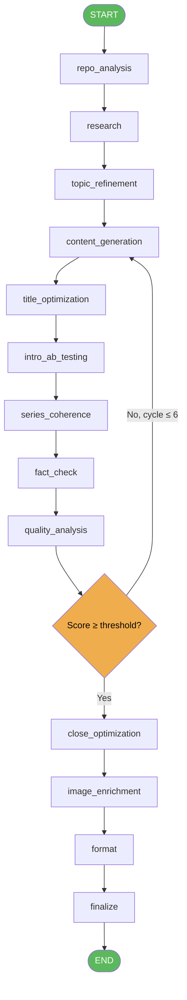

# Pipeline Overview

The pipeline is a directed LangGraph graph with 16 nodes. Each node is a Python async function that calls one or more LLM-backed agents via `ainvoke`. The graph state flows through every node in sequence, with one conditional branch for the quality revision loop.

## Node sequence

| # | Node | Purpose |
|---|------|---------|
| 1 | `repo_analysis` | Reads the GitHub repository to extract context: language, stack, key patterns |
| 2 | `research` | Calls Tavily search to ground the topic with real, up-to-date facts |
| 3 | `topic_refinement` | Refines the raw topic string into a focused, SEO-friendly angle |
| 4 | `content_generation` | Drafts the full article body (~1,700 words) from the refined topic + research |
| 5 | `title_optimization` | Generates 5 title candidates ranked by hook strength and keyword fit |
| 6 | `intro_ab_testing` | Produces two intro variants (direct vs. story-led) for A/B evaluation |
| 7 | `series_coherence` | (Optional) Checks narrative consistency when the post belongs to a series |
| 8 | `fact_check` | Verifies factual claims against the research corpus; flags low-confidence statements |
| 9 | `quality_analysis` | G-Eval rubric: scores depth, clarity, accuracy, hook, and actionability (0–1 each) |
| 10 | `revision_loop` | Conditional: if overall score < threshold, routes back to `content_generation` (max 6 cycles) |
| 11 | `close_optimization` | Rewrites the conclusion for stronger CTA and reader retention |
| 12 | `image_enrichment` | Suggests section headers and alt-text for Unsplash/DALL-E image placement |
| 13 | `format` | Converts the article to Medium-compatible Markdown with correct heading hierarchy |
| 14 | `finalize` | Assembles final payload: title, body, tags, canonical URL, series metadata |

## Flowchart

## Key design decisions

**Conditional revision loop.** The `quality_analysis` node scores each draft against a G-Eval rubric. If the weighted average falls below the configured threshold (default `0.75`), the graph loops back to `content_generation` with critique notes attached to state. A hard cap of 6 cycles prevents infinite loops.

**Optional series_coherence.** When `series_id` is absent from the input, the `series_coherence` node is a pass-through — it adds no latency for standalone posts.

**Structured output throughout.** Every agent uses `.with_structured_output(PydanticModel)` — no raw text parsing anywhere in the graph.

**Quality snapshots.** Each iteration through the revision loop writes a `quality_snapshot` document to MongoDB, enabling post-run analysis of how scores evolved.
