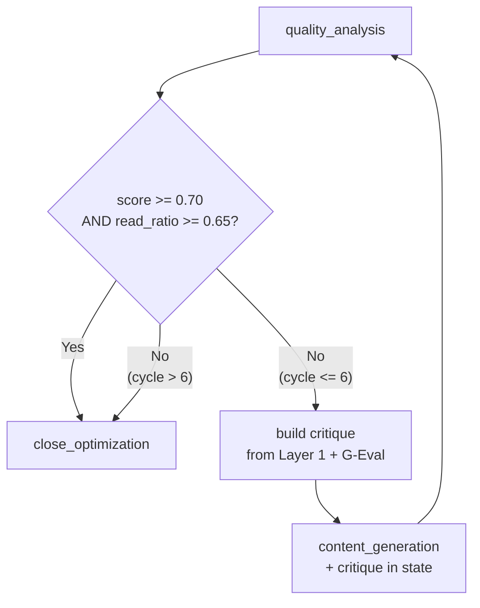

# Quality Gates

Medium Agent Factory enforces quality through three independent layers applied in sequence before a draft is accepted. No layer alone is sufficient — they catch different failure modes.

## Architecture overview

```
Draft output
     │
     ▼
┌─────────────────────────────────┐
│  Layer 1: structural_checker    │  deterministic — no LLM call
│  word count, heading hierarchy, │
│  unattributed claims, list      │
│  density, CTA presence          │
└─────────────┬───────────────────┘
              │ pass
              ▼
┌─────────────────────────────────┐
│  Layer 2: G-Eval rubric         │  LLM-as-judge (GPT-4o)
│  depth · clarity · accuracy     │
│  hook strength · actionability  │
└─────────────┬───────────────────┘
              │ scores → weighted average
              ▼
┌─────────────────────────────────┐
│  Layer 3: config thresholds     │  blocks or routes to revision
│  min_quality_score 0.70         │
│  min_read_ratio   0.65          │
│  max_revision_cycles 6          │
└─────────────────────────────────┘
```

## Layer 1 — Structural checker (deterministic)

The `structural_checker` runs synchronously before any LLM evaluation call. Because it is deterministic, failures here are cheap to surface and fix in the revision prompt.

| Check | Rule | Failure action |
|---|---|---|
| Word count | >= `min_word_count` (default 1300) | Add `EXPAND` instruction to revision prompt |
| Heading hierarchy | H2 before H3, no skipped levels | Add `FIX_HEADINGS` instruction |
| Unattributed claims | No benchmark numbers without a source citation | Add `CITE_OR_HEDGE` instruction |
| List density | No more than 3 consecutive bullet lists without prose between | Add `BREAK_LISTS` instruction |
| CTA presence | Final section must contain a call-to-action | Add `ADD_CTA` instruction |

Failures produce structured critique objects that are injected directly into the revision loop state — the LLM receives targeted instructions, not free-form "improve this" prompts.

## Layer 2 — G-Eval rubric (LLM-as-judge)

The `quality_analysis` node calls a GPT-4o judge via `.with_structured_output(QualityScores)`. The judge scores five dimensions independently on a 0–1 scale:

| Dimension | What it measures | Weight |
|---|---|---|
| `depth` | Technical completeness; does the post go beyond surface coverage? | 0.30 |
| `clarity` | Sentence-level readability; no jargon without explanation | 0.20 |
| `accuracy` | Factual correctness relative to the Tavily research corpus | 0.25 |
| `hook` | Opening paragraph strength; would a reader keep scrolling? | 0.15 |
| `actionability` | Does the reader know what to do next after reading? | 0.10 |

The weighted average becomes `quality_score`. Scores per dimension and the composite are stored in a `quality_snapshot` MongoDB document on every iteration, so you can graph score evolution across revision cycles.

### Structured output schema

```python
class QualityScores(BaseModel):
    depth: float = Field(ge=0.0, le=1.0)
    clarity: float = Field(ge=0.0, le=1.0)
    accuracy: float = Field(ge=0.0, le=1.0)
    hook: float = Field(ge=0.0, le=1.0)
    actionability: float = Field(ge=0.0, le=1.0)
    critique: str  # plain-language notes injected into next revision
    overall: float  # pre-computed weighted average from the judge
```

## Layer 3 — Config thresholds

Thresholds live in `config/quality.yaml` and are loaded once at pipeline startup. Changing a threshold requires no code change — only a config update and a pipeline restart.

| Parameter | Default | Effect when breached |
|---|---|---|
| `min_quality_score` | `0.70` | Routes back to `content_generation` with critique |
| `min_read_ratio` | `0.65` | Routes back; adds `IMPROVE_FLOW` instruction |
| `min_word_count` | `1300` | Caught in Layer 1; adds `EXPAND` instruction |
| `max_revision_cycles` | `6` | Hard cap; pipeline exits with best score seen |

```yaml
# config/quality.yaml
quality:
  min_quality_score: 0.70
  min_read_ratio: 0.65
  min_word_count: 1300
  max_revision_cycles: 6
```

## Revision loop state machine



When the loop exits at the cycle cap, the pipeline emits a `QUALITY_CAP_HIT` warning in the run log and attaches the best-scoring draft seen during the run — it never silently drops work.

## Quality snapshots (MongoDB)

Every pass through `quality_analysis` writes a document to the `quality_snapshots` collection:

```json
{
  "run_id": "uuid-v4",
  "cycle": 2,
  "timestamp": "2026-06-29T14:22:00Z",
  "scores": {
    "depth": 0.82,
    "clarity": 0.79,
    "accuracy": 0.88,
    "hook": 0.71,
    "actionability": 0.75
  },
  "overall": 0.81,
  "structural_issues": ["EXPAND"],
  "critique_length_chars": 412
}
```

This enables post-run analysis: which dimension improves fastest? Which topics consistently require more revision cycles? The data feeds future prompt iterations.
